# Under construction

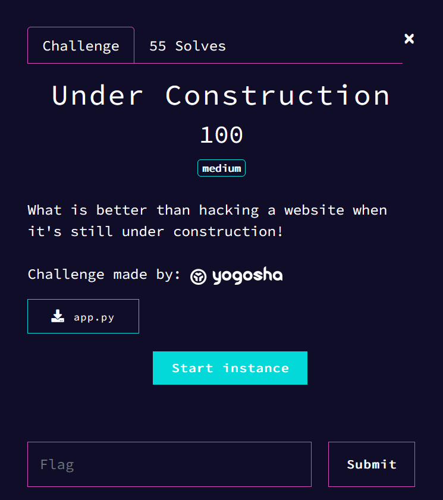

## First look

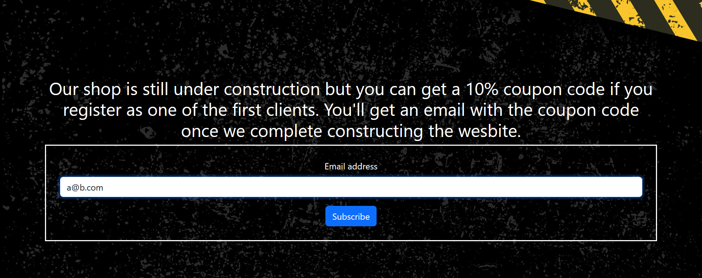

The challenge also provides the code.

```py
#!/usr/bin/python3

from flask import Flask, Response, request, render_template_string
from validate_email import validate_email

UNDER_CONSTRUCTION_SAMPLE = """
<!DOCTYPE html>
<html>
<head>
    <meta name="viewport" content="width=device-width, initial-scale=1.0" />
    <title>Under Construction</title>
    <link href="https://cdn.jsdelivr.net/npm/bootstrap@5.3.1/dist/css/bootstrap.min.css" rel="stylesheet" integrity="sha384-4bw+/aepP/YC94hEpVNVgiZdgIC5+VKNBQNGCHeKRQN+PtmoHDEXuppvnDJzQIu9" crossorigin="anonymous">
    <script src="https://cdn.jsdelivr.net/npm/bootstrap@5.3.1/dist/js/bootstrap.bundle.min.js" integrity="sha384-HwwvtgBNo3bZJJLYd8oVXjrBZt8cqVSpeBNS5n7C8IVInixGAoxmnlMuBnhbgrkm" crossorigin="anonymous"></script>
</head>
<body style="background-image: url('{{url_for('static', filename='under-construction.jpg')}}'); background-repeat: no-repeat; background-size: cover; background-position: center; margin: 0; width: 100vw; height: 100vh;">
    <div style="position: absolute; left: 50%; top: 50%; transform: translate(-50%, -50%);" class="container">
        <h2 style="text-align: center; color: white;">Our shop is still under construction but you can get a 10% coupon code if you register as one of the first clients. You'll get an email with the coupon code once we complete constructing the wesbite.</h2>
        <form style="text-align: center; border: 2px solid white; padding: 25px;" method="POST" action="/subscribe">
            <div class="mb-3">
                <label style="color: white;" for="exampleInputEmail1" class="form-label">Email address</label>
                <input name="email" type="email" class="form-control" id="exampleInputEmail1" aria-describedby="emailHelp">
            </div>
            <button type="submit" class="btn btn-primary">Subscribe</button>
        </form>
    </div>
</body>
</html>
"""

BLACKLIST = ["{{", "}}", "_", "[", "]", "\\", "args", "form", "'"]

app = Flask(__name__)

@app.route("/", methods = ["GET"])
def challenge():
    return render_template_string(UNDER_CONSTRUCTION_SAMPLE)

@app.route("/subscribe", methods = ["POST"])
def subscribe():
    print("Im in the subscribe function")
    if ("email" in request.form and validate_email(request.form.get("email"), check_smtp = True, check_dns = True)):
        if (any([i in request.form.get("email") for i in BLACKLIST]) or len(request.form.get("email")) > 100):
            return render_template_string("Hacking attempt detected!")
        return render_template_string(f"Thanks for subscribing {request.form.get('email')}, you'll get coupon code once we complete developing our shop!")
    else:
        return render_template_string("No email was passed or email is invalid or doesn't really exist!")


app.run("0.0.0.0", 8080, debug = False)
```

With the source code, we can see that the program uses a function `validate_email`, then it checks a blacklist and ensure that that the payload does less than 100 chars.

If we bypass everything, the program executes `render_template_string` which can lead to SSTI(Server Side Template Injection).

Let's firstly try to bypass `validate_email`.

## First bypass

If we llok on the internet, we can quickly find that this is a python library, with a github repository. If we look at the issues on this github, we can find this one 

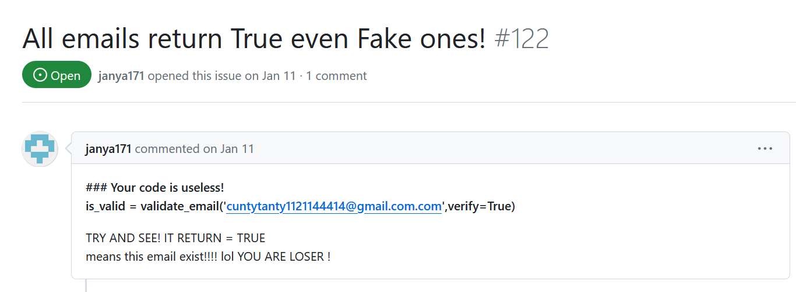

(https://github.com/syrusakbary/validate_email/issues/122)

So, we simply need to use an adress with `.com.com`.

Another problem arise if we use () in our email, one way to bypass this is by using  `"`, so the payload will be :

```
"payload"@gmail.com.com
```

## Second bypass

Now that we can freely put some string, we need to ensure that our payload : 
- does not contains `["{{", "}}", "_", "[", "]", "\\", "args", "form", "'"]`
- does less than 100 char

It's highly likely that we need to do a RCE(Remote Code Exceution) because there is nothing related to a flag in the source code.

Because `{{` and `}}` aren't allowed, we can only use `` to do a SSTI.

Let's try to print someting.

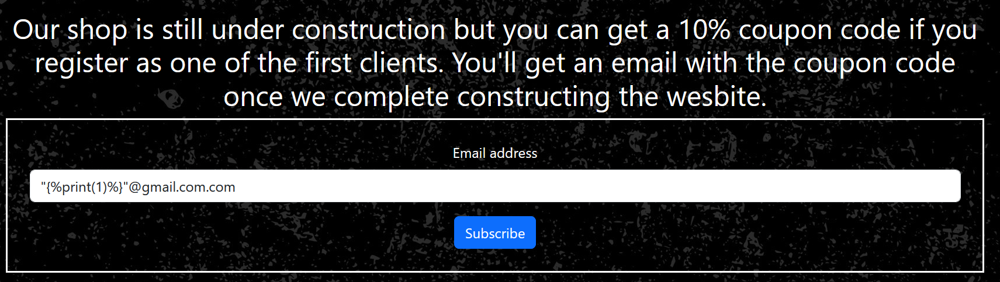

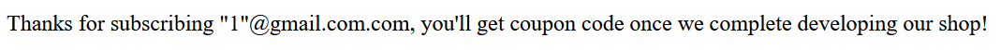

That worked !! 

What limits us is the `_` and `[]` blocking.

There is a trick in python to bypass that.

When we need to access attributes without using `_` and `[]`, we can use 

```
obj|attr(name)
```

But we can't put the name, because we need to use a string and `'` is blocked and `\"` is also blocked.

To bypass that, I used `request.headers.c`, and sent a header called `c` in the request.

After some research, I found a way of having os with that bypass

```
""@gmail.com.com
# with
c = __init__
b = __globals__
```

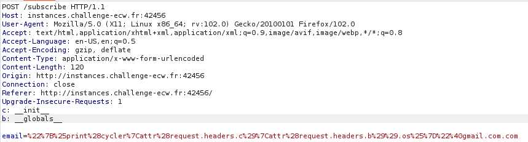

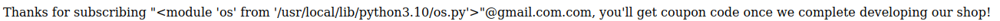

The problem here, is that using `.popen(request.headers.d).read()` is to long.

After searching a bit, I found

```
""@a.com.com
c: __globals__
```

Which is way shorter and also works.


So, the final payload is

```
""@a.com.com
c: __globals__
d: <command>
```

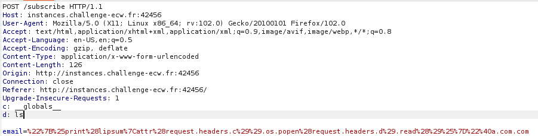

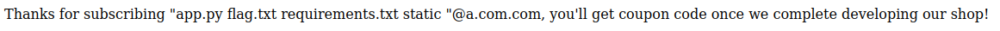


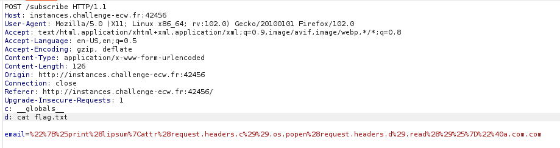

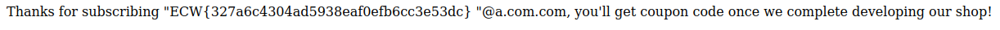

And here we have the flag `ECW{327a6c4304ad5938eaf0efb6cc3e53dc}`
